# Reddit Scout — Local LLM

Run: 2026-03-24T12-32-11-046Z
Started: 2026-03-24T12:32:11.047Z
Output dir: /home/ubuntu/.openclaw/workspace-ce/users/8176450202/reddit-scout/local-llm/runs/2026-03-24T12-32-11-046Z

Config: topN=30 | subLimit=10 | kinds=top,hot,rising | time=all | limitPerListing=25
Search: Local LLM (sort=top t=auto)

## Top terms (from titles + top comments)

- local (8)
- built (4)
- testing (3)
- based (3)
- which (2)
- model (2)
- stuff (2)
- agent (2)
- made (2)
- even (2)
- benchmark (2)
- openclaw (2)
- tool (2)
- eval (2)
- multi (2)
- when (2)
- running (1)
- overland (1)

## Viral content ideas (derived from these posts)

**1. Personal story → timeline + receipts**
- Hook: Hook with 1 line, then a 5-step timeline; end with the lesson and what you would do differently.

**2. My local got automated: what I automated back (tools + workflow)**
- Hook: Turn it into a before/after workflow post. Include exact tool stack + steps.

**3. Checklist: how to stay valuable when built hits your team**
- Hook: A numbered checklist (10 items). Make it practical: skills, portfolio, outreach, proof-of-work.

**4. Hot take: testing isn't the problem — based is**
- Hook: Contrarian framing. Back it with 2 examples from the top posts and 1 counterexample.

**5. Debunk thread: "AI will replace which" vs what's actually happening**
- Hook: Use 3 claims → 3 rebuttals. Cite specific post patterns: layoffs, hiring freezes, role shifts.

**6. Salary/market reality: model vs stuff roles in 2026 (Reddit signals)**
- Hook: Summarize demand signals from comments: who is struggling, who is fine, why.

**7. "What would you do in 30 days?" layoff recovery plan (day-by-day)**
- Hook: 30-day plan: portfolio, interview loops, networking, mental health. Include a downloadable checklist.

**8. Mini-case study: 1 resume bullet → 1 proof project using agent**
- Hook: Show how to convert a vague resume claim into a measurable project + writeup.

**9. Community question: which tasks should *never* be delegated to AI?**
- Hook: Ask + give your own top 5. Encourage replies; add a poll if your platform supports it.

**10. Template post: "I used AI to do X, got Y result, here's the exact prompt"**
- Hook: Make it reproducible: prompt, inputs, outputs, gotchas.

**11. Data post: a quick scorecard of the top threads (ups, comments, ratio) + what it signals**
- Hook: Table or bullets; then 3 takeaways.

**12. Meme angle (if relevant): made vs even — job search edition**
- Hook: If your niche is not memes, skip memes; otherwise caption the pattern you saw in comments.

## Top posts (19) + cards

### 1) Which local model we running on the overland Jeep fellas?
- Subreddit: r/LocalLLaMA
- Viral score: 49 | Ups: 241 | Comments: 100 | Upvote ratio: 96%
- Link: https://www.reddit.com/r/LocalLLaMA/comments/1s1kyla/which_local_model_we_running_on_the_overland_jeep/
- Card (local): ./cards/1s1kyla.png

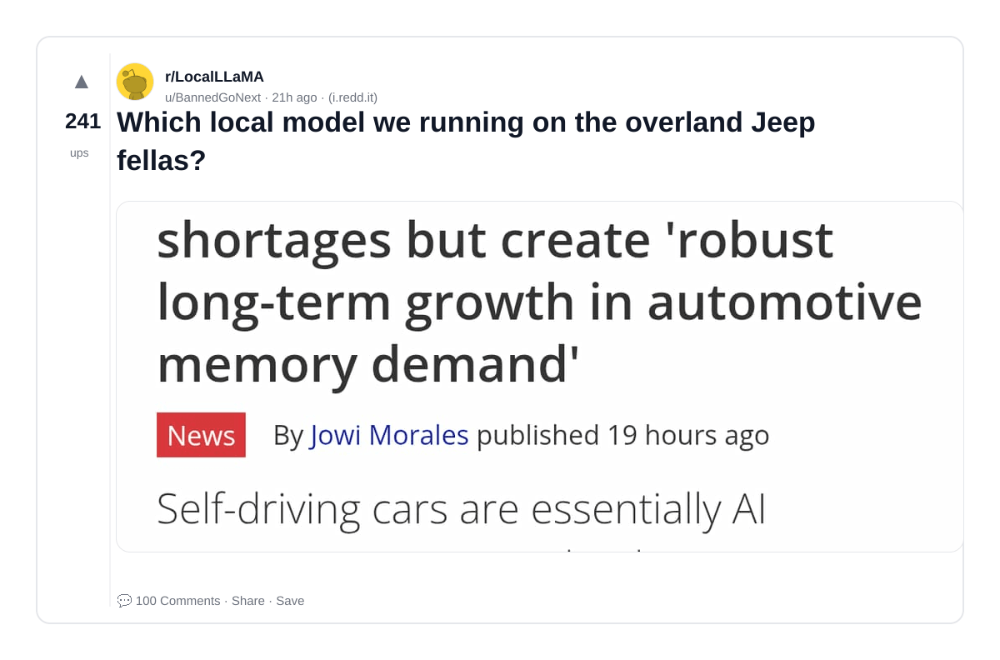

### 2) I came from Data Engineering stuff before jumping into LLM stuff, i am surprised that many people in this space never heard Elastic/OpenSearch
- Subreddit: r/LocalLLaMA
- Viral score: 32 | Ups: 407 | Comments: 70 | Upvote ratio: 92%
- Link: https://www.reddit.com/r/LocalLLaMA/comments/1s17afx/i_came_from_data_engineering_stuff_before_jumping/
- Card (local): ./cards/1s17afx.png

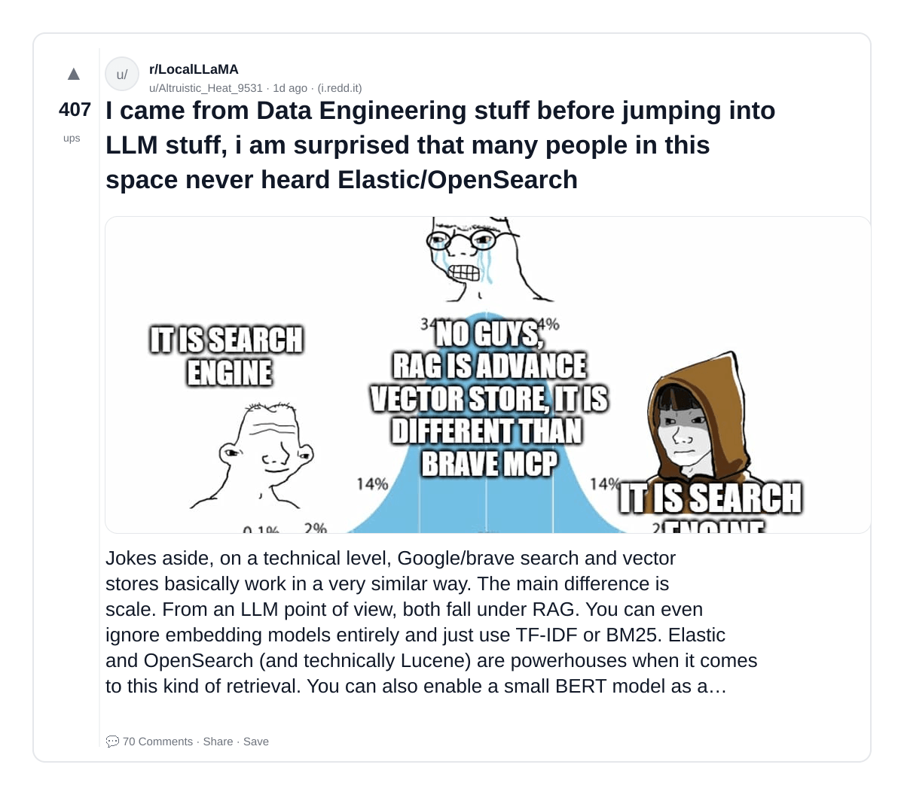

### 3) Feedback on my 256gb VRAM local setup and cluster plans. Lawyer keeping it local.
- Subreddit: r/LocalLLaMA
- Viral score: 17 | Ups: 408 | Comments: 221 | Upvote ratio: 88%
- Link: https://www.reddit.com/r/LocalLLaMA/comments/1rzg33q/feedback_on_my_256gb_vram_local_setup_and_cluster/
- Card (local): ./cards/1rzg33q.png

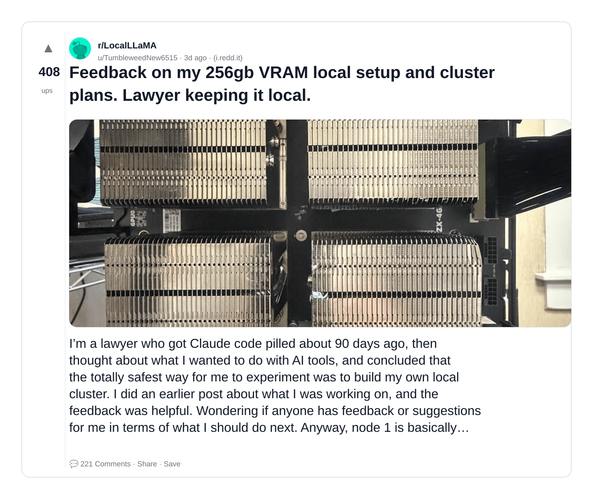

### 4) Lessons from building a permanent companion agent on local hardware
- Subreddit: r/LocalLLaMA
- Viral score: 6 | Ups: 20 | Comments: 10 | Upvote ratio: 83%
- Link: https://www.reddit.com/r/LocalLLaMA/comments/1s2181s/lessons_from_building_a_permanent_companion_agent/
- Card (local): ./cards/1s2181s.png

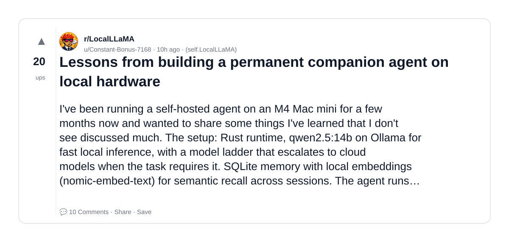

### 5) I feel like if they made a local model focused specifically on RP it would be god tier even if tiny
- Subreddit: r/LocalLLaMA
- Viral score: 5 | Ups: 26 | Comments: 23 | Upvote ratio: 73%
- Link: https://www.reddit.com/r/LocalLLaMA/comments/1s1q5et/i_feel_like_if_they_made_a_local_model_focused/
- Card (local): ./cards/1s1q5et.png

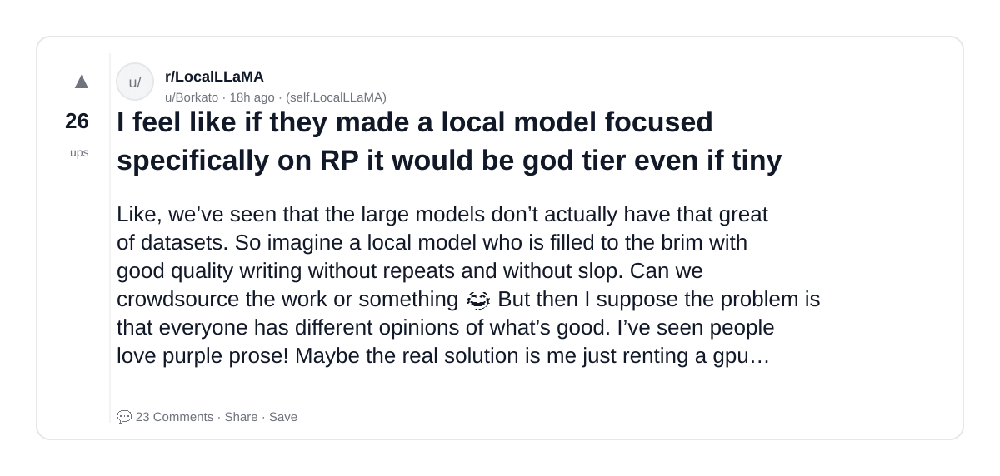

### 6) Jake Benchmark v1: I spent a week watching 7 local LLMs try to be AI agents with OpenClaw. Most couldn't even find the email tool.
- Subreddit: r/LocalLLaMA
- Viral score: 4 | Ups: 21 | Comments: 18 | Upvote ratio: 87%
- Link: https://www.reddit.com/r/LocalLLaMA/comments/1s1oaid/jake_benchmark_v1_i_spent_a_week_watching_7_local/
- Card (local): ./cards/1s1oaid.png

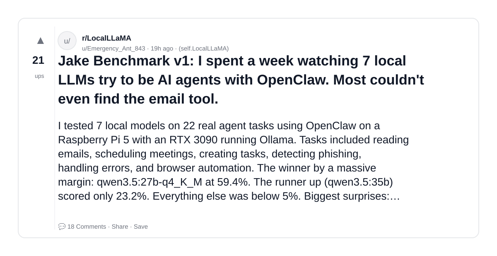

### 7) 7MB binary-weight Mamba LLM — zero floating-point at inference, runs in browser
- Subreddit: r/LocalLLaMA
- Viral score: 4 | Ups: 30 | Comments: 24 | Upvote ratio: 63%
- Link: https://www.reddit.com/r/LocalLLaMA/comments/1s1iw91/7mb_binaryweight_mamba_llm_zero_floatingpoint_at/
- Card (local): ./cards/1s1iw91.png

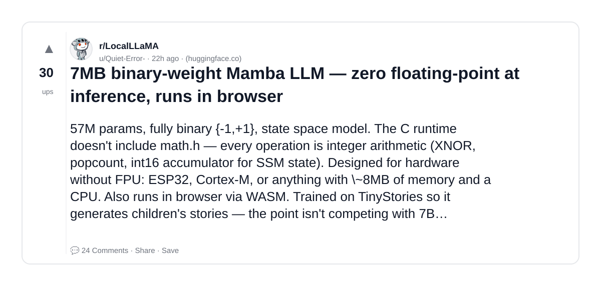

### 8) MacBook M5 Ultra vs DGX Spark for local AI, which one would you actually pick if you could only buy one?
- Subreddit: r/LLMDevs
- Viral score: 4 | Ups: 24 | Comments: 31 | Upvote ratio: 91%
- Link: https://www.reddit.com/r/LLMDevs/comments/1s1c88z/macbook_m5_ultra_vs_dgx_spark_for_local_ai_which/
- Card (local): ./cards/1s1c88z.png

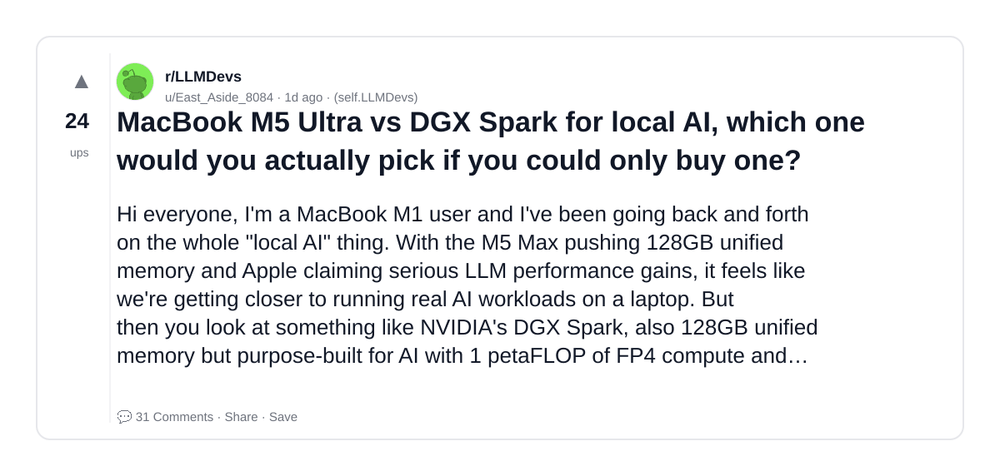

### 9) so is OpenClaw local or not
- Subreddit: r/LocalLLaMA
- Viral score: 3 | Ups: 1023 | Comments: 301 | Upvote ratio: 92%
- Link: https://www.reddit.com/r/LocalLLaMA/comments/1rcmlwk/so_is_openclaw_local_or_not/
- Card (local): ./cards/1rcmlwk.png

### 10) 4 LLM eval startups acquired in 5 months. The independent eval layer is shrinking fast.
- Subreddit: r/LLMDevs
- Viral score: 3 | Ups: 21 | Comments: 10 | Upvote ratio: 96%
- Link: https://www.reddit.com/r/LLMDevs/comments/1s1ic2z/4_llm_eval_startups_acquired_in_5_months_the/
- Card (local): ./cards/1s1ic2z.png

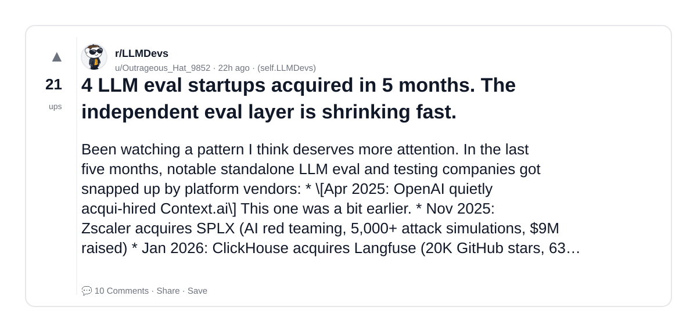

### 11) How are you testing multi-turn conversation quality in your LLM apps?
- Subreddit: r/LLMDevs
- Viral score: 2 | Ups: 2 | Comments: 12 | Upvote ratio: 67%
- Link: https://www.reddit.com/r/LLMDevs/comments/1s1zxt7/how_are_you_testing_multiturn_conversation/
- Card (local): ./cards/1s1zxt7.png

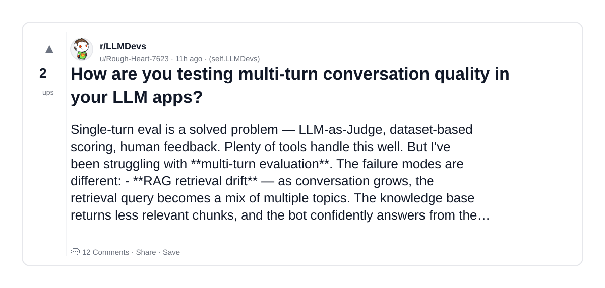

### 12) LLM (Gemini) timing out when parsing structured PDF tables — what’s the best approach?
- Subreddit: r/LLMDevs
- Viral score: 1 | Ups: 1 | Comments: 4 | Upvote ratio: 99%
- Link: https://www.reddit.com/r/LLMDevs/comments/1s1ztdk/llm_gemini_timing_out_when_parsing_structured_pdf/
- Card (local): ./cards/1s1ztdk.png

### 13) Built a Multi-agent Frontier LLM adjudication system - Thoughts on process?
- Subreddit: r/LLMDevs
- Viral score: 1 | Ups: 1 | Comments: 3 | Upvote ratio: 100%
- Link: https://www.reddit.com/r/LLMDevs/comments/1s1ydcj/built_a_multiagent_frontier_llm_adjudication/
- Card (local): ./cards/1s1ydcj.png

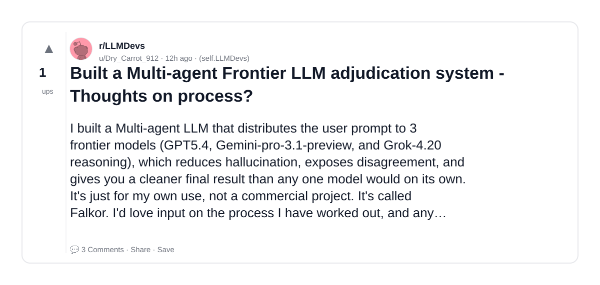

### 14) LLM-based OCR is significantly outperforming traditional ML-based OCR, especially for downstream LLM tasks
- Subreddit: r/LLMDevs
- Viral score: 0 | Ups: 16 | Comments: 28 | Upvote ratio: 73%
- Link: https://www.reddit.com/r/LLMDevs/comments/1rx6qnk/llmbased_ocr_is_significantly_outperforming/
- Card (local): ./cards/1rx6qnk.png

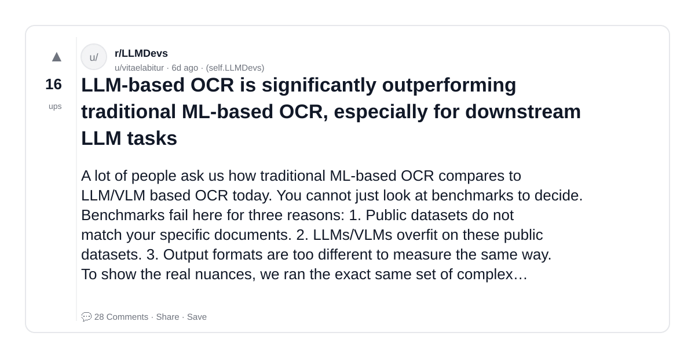

### 15) Has anyone built regression testing for LLM-based chatbots? How do you handle it?
- Subreddit: r/LLMDevs
- Viral score: 0 | Ups: 7 | Comments: 11 | Upvote ratio: 100%
- Link: https://www.reddit.com/r/LLMDevs/comments/1rymyno/has_anyone_built_regression_testing_for_llmbased/
- Card (local): ./cards/1rymyno.png

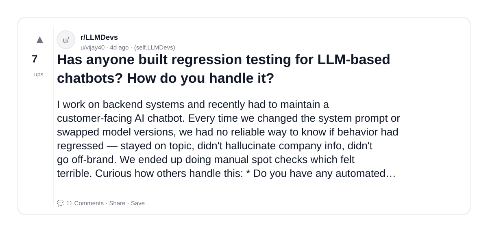

### 16) Built an open-source tool to detect when few-shot examples degrade LLM performance (three patterns I found testing 8 models)
- Subreddit: r/LLMDevs
- Viral score: 0 | Ups: 1 | Comments: 0 | Upvote ratio: 100%
- Link: https://www.reddit.com/r/LLMDevs/comments/1s257cg/built_an_opensource_tool_to_detect_when_fewshot/
- Card (local): ./cards/1s257cg.png

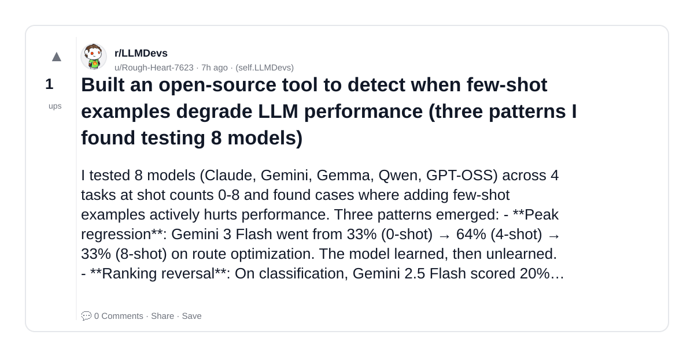

### 17) SuperGPT is a framework to create your own LLM
- Subreddit: r/LLMDevs
- Viral score: 0 | Ups: 1 | Comments: 0 | Upvote ratio: 100%
- Link: https://www.reddit.com/r/LLMDevs/comments/1s1zitk/supergpt_is_a_framework_to_create_your_own_llm/
- Card (local): ./cards/1s1zitk.png

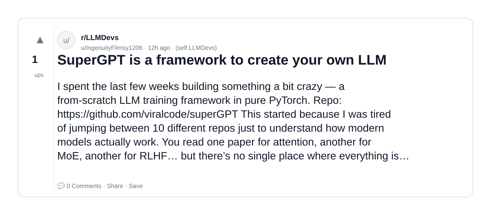

### 18) I made LocalRouter: swiss army knife for LLM and MCP development
- Subreddit: r/LLMDevs
- Viral score: 0 | Ups: 2 | Comments: 0 | Upvote ratio: 100%
- Link: https://www.reddit.com/r/LLMDevs/comments/1s1gtix/i_made_localrouter_swiss_army_knife_for_llm_and/
- Card (local): ./cards/1s1gtix.png

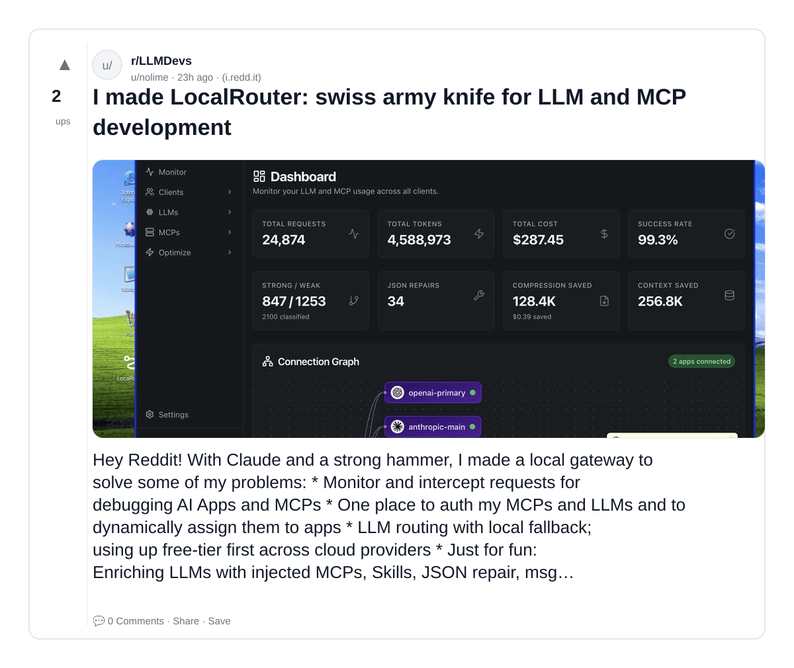

### 19) Built a CLI to benchmark any LLM on function calling. Ollama + OpenRouter supported
- Subreddit: r/LLMDevs
- Viral score: 0 | Ups: 8 | Comments: 3 | Upvote ratio: 100%
- Link: https://www.reddit.com/r/LLMDevs/comments/1rw718j/built_a_cli_to_benchmark_any_llm_on_function/
- Card (local): ./cards/1rw718j.png

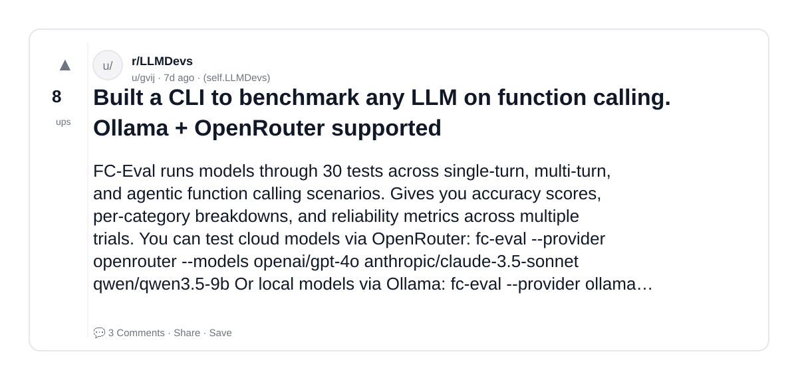
