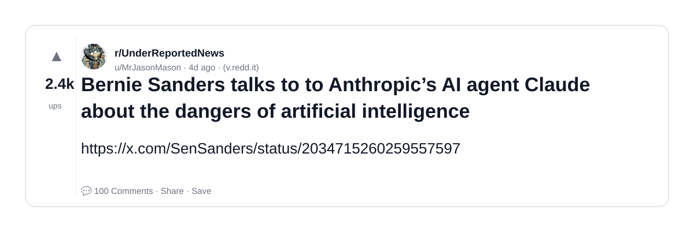
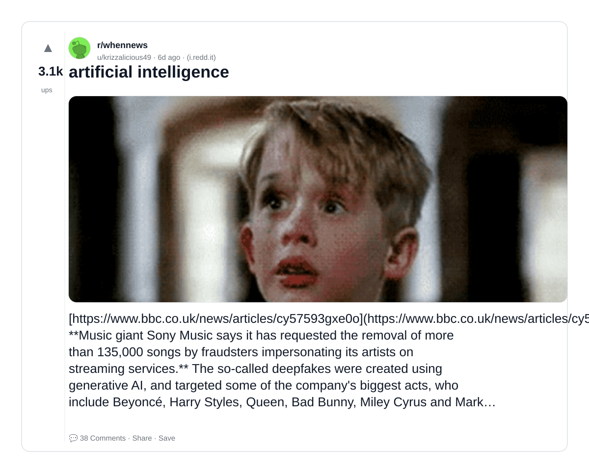
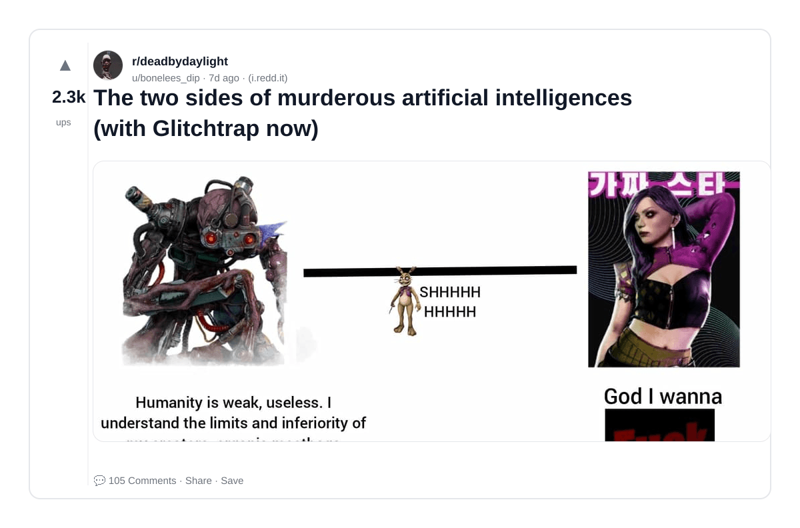
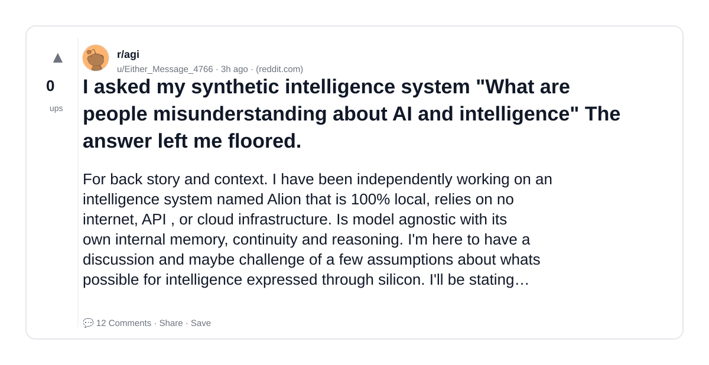
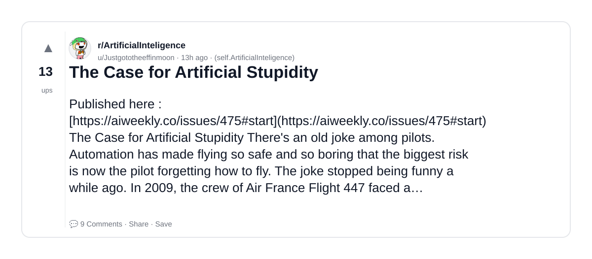
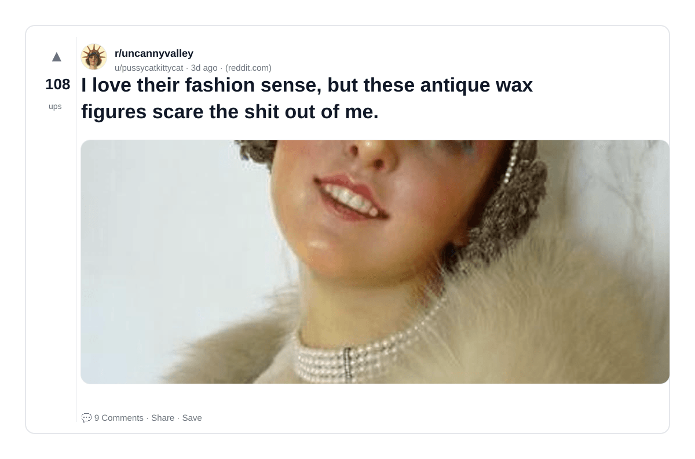
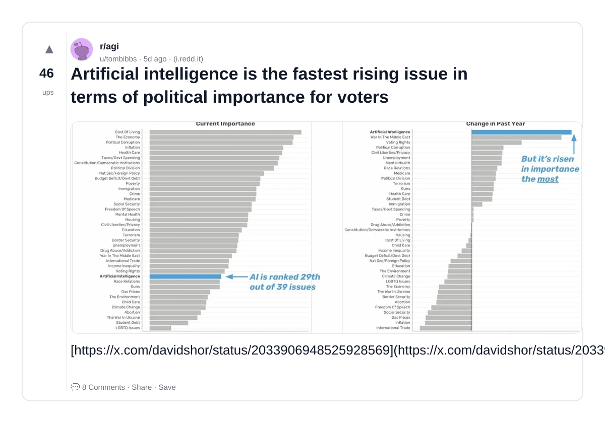
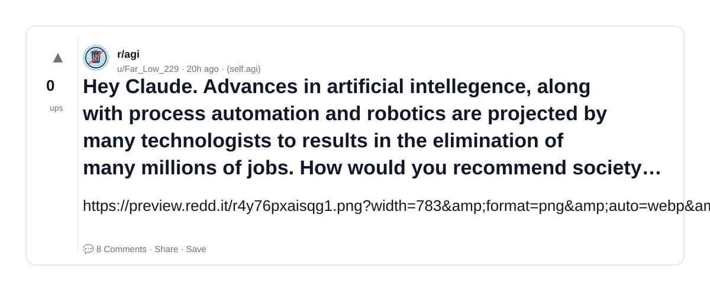
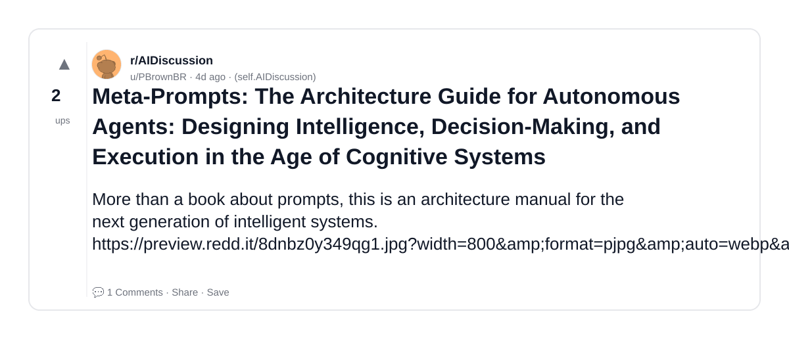
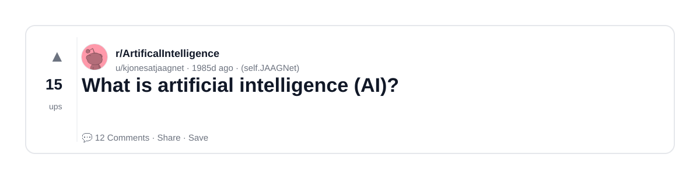

# Reddit Scout — Love artificial intelligence

Run: 2026-03-24T08-38-19-414Z
Started: 2026-03-24T08:38:19.415Z
Output dir: /home/ubuntu/.openclaw/workspace-ce/users/8176450202/reddit-scout/love-artificial-intelligence/runs/2026-03-24T08-38-19-414Z

Config: topN=10 | subLimit=10 | kinds=top,hot,rising | time=week | limitPerListing=25
Search: Love artificial intelligence (sort=top t=auto)

## Top terms (from titles + top comments)

- music (13)
- artificial (11)
- intelligence (10)
- what (8)
- streaming (7)
- industry (7)
- about (6)
- said (6)
- artist (6)
- sony (5)
- such (5)
- human (5)
- claude (4)
- good (4)
- artists (4)
- kooker (4)
- generated (4)
- https (4)

## Viral content ideas (derived from these posts)

**1. Personal story → timeline + receipts**
- Hook: Hook with 1 line, then a 5-step timeline; end with the lesson and what you would do differently.

**2. My music got automated: what I automated back (tools + workflow)**
- Hook: Turn it into a before/after workflow post. Include exact tool stack + steps.

**3. Checklist: how to stay valuable when artificial hits your team**
- Hook: A numbered checklist (10 items). Make it practical: skills, portfolio, outreach, proof-of-work.

**4. Hot take: intelligence isn't the problem — what is**
- Hook: Contrarian framing. Back it with 2 examples from the top posts and 1 counterexample.

**5. Debunk thread: "AI will replace streaming" vs what's actually happening**
- Hook: Use 3 claims → 3 rebuttals. Cite specific post patterns: layoffs, hiring freezes, role shifts.

**6. Salary/market reality: industry vs about roles in 2026 (Reddit signals)**
- Hook: Summarize demand signals from comments: who is struggling, who is fine, why.

**7. "What would you do in 30 days?" layoff recovery plan (day-by-day)**
- Hook: 30-day plan: portfolio, interview loops, networking, mental health. Include a downloadable checklist.

**8. Mini-case study: 1 resume bullet → 1 proof project using said**
- Hook: Show how to convert a vague resume claim into a measurable project + writeup.

**9. Community question: which tasks should *never* be delegated to AI?**
- Hook: Ask + give your own top 5. Encourage replies; add a poll if your platform supports it.

**10. Template post: "I used AI to do X, got Y result, here's the exact prompt"**
- Hook: Make it reproducible: prompt, inputs, outputs, gotchas.

**11. Data post: a quick scorecard of the top threads (ups, comments, ratio) + what it signals**
- Hook: Table or bullets; then 3 takeaways.

**12. Meme angle (if relevant): artist vs sony — job search edition**
- Hook: If your niche is not memes, skip memes; otherwise caption the pattern you saw in comments.

## Top posts (10) + cards

### 1) Bernie Sanders talks to to Anthropic’s AI agent Claude about the dangers of artificial intelligence
- Subreddit: r/UnderReportedNews
- Viral score: 55 | Ups: 2421 | Comments: 100 | Upvote ratio: 98%
- Link: https://www.reddit.com/r/UnderReportedNews/comments/1rymdug/bernie_sanders_talks_to_to_anthropics_ai_agent/
- Card (local): ./cards/1rymdug.png

### 2) artificial intelligence
- Subreddit: r/whennews
- Viral score: 43 | Ups: 3095 | Comments: 38 | Upvote ratio: 100%
- Link: https://www.reddit.com/r/whennews/comments/1rxau5i/artificial_intelligence/
- Card (local): ./cards/1rxau5i.png

### 3) The two sides of murderous artificial intelligences (with Glitchtrap now)
- Subreddit: r/deadbydaylight
- Viral score: 32 | Ups: 2281 | Comments: 105 | Upvote ratio: 99%
- Link: https://www.reddit.com/r/deadbydaylight/comments/1rwcsdy/the_two_sides_of_murderous_artificial/
- Card (local): ./cards/1rwcsdy.png

### 4) I asked my synthetic intelligence system "What are people misunderstanding about AI and intelligence" The answer left me floored.
- Subreddit: r/agi
- Viral score: 6 | Ups: 0 | Comments: 12 | Upvote ratio: 25%
- Link: https://www.reddit.com/r/agi/comments/1s255xu/i_asked_my_synthetic_intelligence_system_what_are/
- Card (local): ./cards/1s255xu.png

### 5) The Case for Artificial Stupidity
- Subreddit: r/ArtificialInteligence
- Viral score: 3 | Ups: 13 | Comments: 9 | Upvote ratio: 84%
- Link: https://www.reddit.com/r/ArtificialInteligence/comments/1s1rsoo/the_case_for_artificial_stupidity/
- Card (local): ./cards/1s1rsoo.png

### 6) I love their fashion sense, but these antique wax figures scare the shit out of me.
- Subreddit: r/uncannyvalley
- Viral score: 3 | Ups: 108 | Comments: 9 | Upvote ratio: 100%
- Link: https://www.reddit.com/r/uncannyvalley/comments/1rzntgj/i_love_their_fashion_sense_but_these_antique_wax/
- Card (local): ./cards/1rzntgj.png

### 7) Artificial intelligence is the fastest rising issue in terms of political importance for voters
- Subreddit: r/agi
- Viral score: 1 | Ups: 46 | Comments: 8 | Upvote ratio: 93%
- Link: https://www.reddit.com/r/agi/comments/1ry0hud/artificial_intelligence_is_the_fastest_rising/
- Card (local): ./cards/1ry0hud.png

### 8) Hey Claude. Advances in artificial intellegence, along with process automation and robotics are projected by many technologists to results in the elimination of many millions of jobs. How would you recommend society and its governance prepare for and accommodate this change?
- Subreddit: r/agi
- Viral score: 1 | Ups: 0 | Comments: 8 | Upvote ratio: 40%
- Link: https://www.reddit.com/r/agi/comments/1s1fpvi/hey_claude_advances_in_artificial_intellegence/
- Card (local): ./cards/1s1fpvi.png

### 9) Meta-Prompts: The Architecture Guide for Autonomous Agents: Designing Intelligence, Decision-Making, and Execution in the Age of Cognitive Systems
- Subreddit: r/AIDiscussion
- Viral score: 0 | Ups: 2 | Comments: 1 | Upvote ratio: 100%
- Link: https://www.reddit.com/r/AIDiscussion/comments/1rz5p6g/metaprompts_the_architecture_guide_for_autonomous/
- Card (local): ./cards/1rz5p6g.png

### 10) What is artificial intelligence (AI)?
- Subreddit: r/ArtificalIntelligence
- Viral score: 0 | Ups: 15 | Comments: 12 | Upvote ratio: 95%
- Link: https://www.reddit.com/r/ArtificalIntelligence/comments/jce408/what_is_artificial_intelligence_ai/
- Card (local): ./cards/jce408.png

