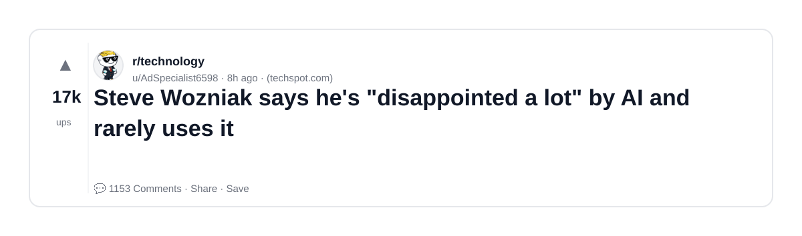
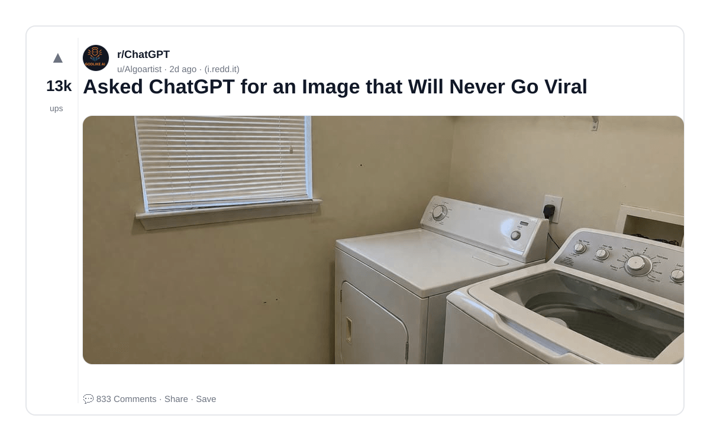
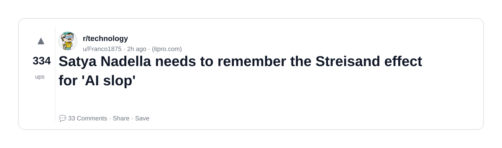
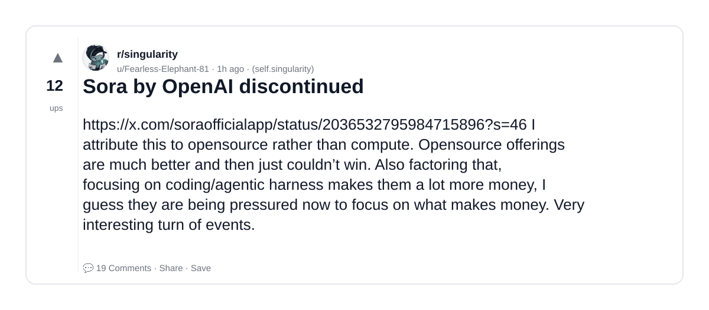
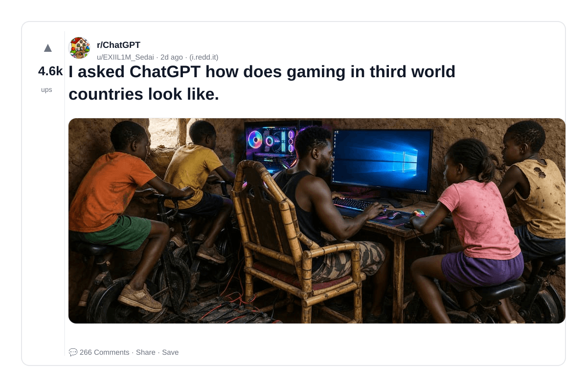
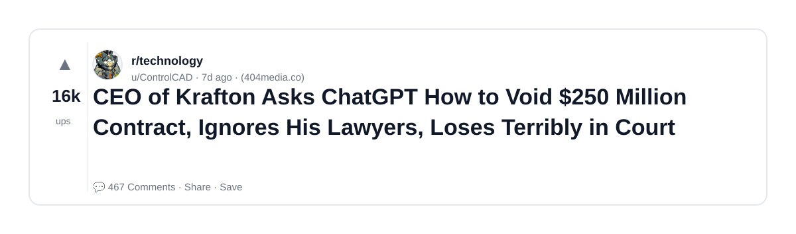
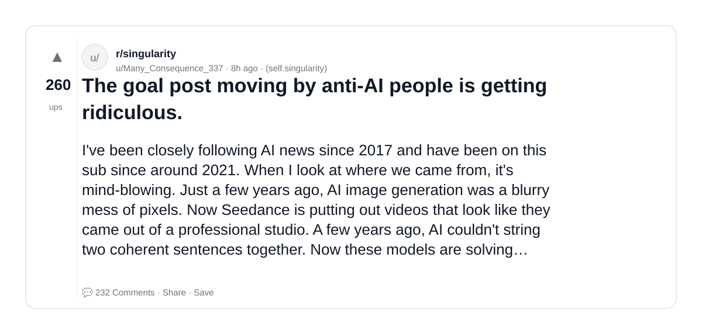
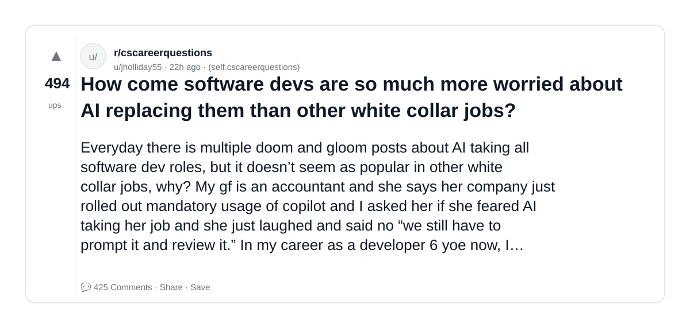
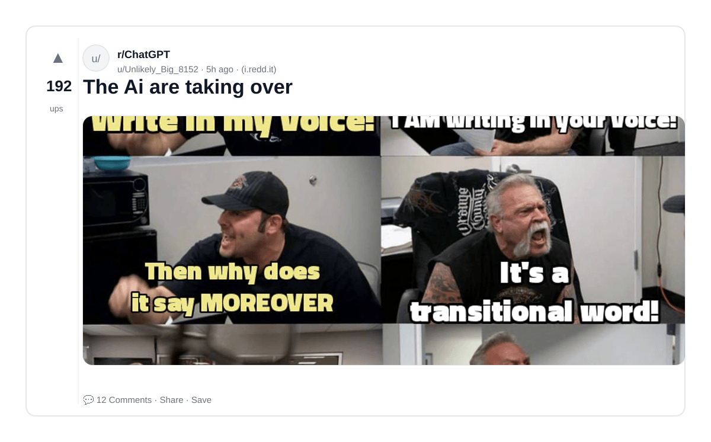
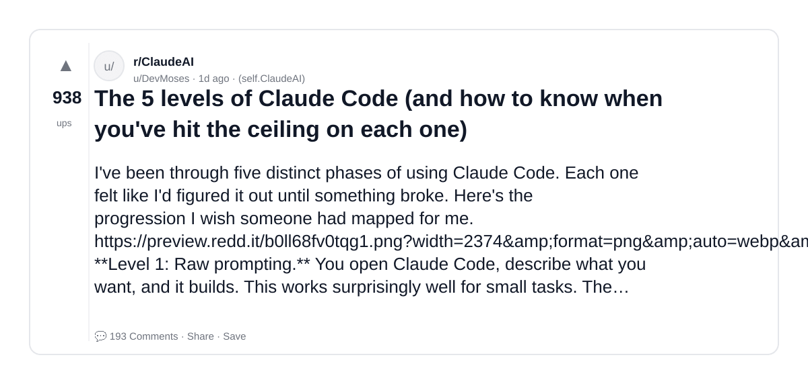

# Reddit Scout — OpenAI vs Anthropic Claude vs ChatGPT GPT-5 Claude AI comparison backend developer

Run: 2026-03-24T21-05-16-948Z
Started: 2026-03-24T21:05:16.948Z
Output dir: /home/ubuntu/.openclaw/workspace-ce/users/8176450202/reddit-scout/openai-vs-anthropic-claude-vs-chatgpt-gpt-5-claude-ai-compar/runs/2026-03-24T21-05-16-948Z

Config: topN=20 | subLimit=20 | kinds=top,hot,rising | time=week | limitPerListing=25
Search: OpenAI vs Anthropic Claude vs ChatGPT GPT-5 Claude AI comparison backend developer (sort=top t=auto)

## Top terms (from titles + top comments)

- sora (12)
- like (10)
- people (10)
- https (9)
- openai (8)
- claude (8)
- more (8)
- right (8)
- will (7)
- them (7)
- what (7)
- chatgpt (6)
- slop (6)
- much (6)
- when (6)
- make (6)
- human (6)
- there (6)

## Viral content ideas (derived from these posts)

**1. Personal story → timeline + receipts**
- Hook: Hook with 1 line, then a 5-step timeline; end with the lesson and what you would do differently.

**2. My sora got automated: what I automated back (tools + workflow)**
- Hook: Turn it into a before/after workflow post. Include exact tool stack + steps.

**3. Checklist: how to stay valuable when like hits your team**
- Hook: A numbered checklist (10 items). Make it practical: skills, portfolio, outreach, proof-of-work.

**4. Hot take: people isn't the problem — https is**
- Hook: Contrarian framing. Back it with 2 examples from the top posts and 1 counterexample.

**5. Debunk thread: "AI will replace openai" vs what's actually happening**
- Hook: Use 3 claims → 3 rebuttals. Cite specific post patterns: layoffs, hiring freezes, role shifts.

**6. Salary/market reality: claude vs more roles in 2026 (Reddit signals)**
- Hook: Summarize demand signals from comments: who is struggling, who is fine, why.

**7. "What would you do in 30 days?" layoff recovery plan (day-by-day)**
- Hook: 30-day plan: portfolio, interview loops, networking, mental health. Include a downloadable checklist.

**8. Mini-case study: 1 resume bullet → 1 proof project using right**
- Hook: Show how to convert a vague resume claim into a measurable project + writeup.

**9. Community question: which tasks should *never* be delegated to AI?**
- Hook: Ask + give your own top 5. Encourage replies; add a poll if your platform supports it.

**10. Template post: "I used AI to do X, got Y result, here's the exact prompt"**
- Hook: Make it reproducible: prompt, inputs, outputs, gotchas.

**11. Data post: a quick scorecard of the top threads (ups, comments, ratio) + what it signals**
- Hook: Table or bullets; then 3 takeaways.

**12. Meme angle (if relevant): will vs them — job search edition**
- Hook: If your niche is not memes, skip memes; otherwise caption the pattern you saw in comments.

## Top posts (20) + cards

### 1) Steve Wozniak says he's "disappointed a lot" by AI and rarely uses it
- Subreddit: r/technology
- Viral score: 8960 | Ups: 16589 | Comments: 1153 | Upvote ratio: 96%
- Link: https://www.reddit.com/r/technology/comments/1s2cme5/steve_wozniak_says_hes_disappointed_a_lot_by_ai/
- Card (local): ./cards/1s2cme5.png

### 2) OpenAI Will Shut Down Sora Video Platform
- Subreddit: r/technology
- Viral score: 3558 | Ups: 431 | Comments: 70 | Upvote ratio: 98%
- Link: https://www.reddit.com/r/technology/comments/1s2piv1/openai_will_shut_down_sora_video_platform/
- Card (local): ./cards/1s2piv1.png

### 3) The AI Economy Is “Propped Up by a Ponzi Scheme,” Says Director of ‘The AI Doc’
- Subreddit: r/technology
- Viral score: 3047 | Ups: 4010 | Comments: 384 | Upvote ratio: 97%
- Link: https://www.reddit.com/r/technology/comments/1s2gt0a/the_ai_economy_is_propped_up_by_a_ponzi_scheme/
- Card (local): ./cards/1s2gt0a.png

### 4) Tired of authors using ChatGPT in their books
- Subreddit: r/ChatGPT
- Viral score: 1593 | Ups: 1556 | Comments: 200 | Upvote ratio: 90%
- Link: https://www.reddit.com/r/ChatGPT/comments/1s2jnpg/tired_of_authors_using_chatgpt_in_their_books/
- Card (local): ./cards/1s2jnpg.png

### 5) OPENAI TO DISCONTINUE SORA !!
- Subreddit: r/OpenAI
- Viral score: 1565 | Ups: 340 | Comments: 81 | Upvote ratio: 97%
- Link: https://www.reddit.com/r/OpenAI/comments/1s2onhy/openai_to_discontinue_sora/
- Card (local): ./cards/1s2onhy.png

### 6) Asked ChatGPT for an Image that Will Never Go Viral
- Subreddit: r/ChatGPT
- Viral score: 875 | Ups: 13388 | Comments: 833 | Upvote ratio: 89%
- Link: https://www.reddit.com/r/ChatGPT/comments/1s1224n/asked_chatgpt_for_an_image_that_will_never_go/
- Card (local): ./cards/1s1224n.png

### 7) Satya Nadella needs to remember the Streisand effect for 'AI slop'
- Subreddit: r/technology
- Viral score: 642 | Ups: 334 | Comments: 33 | Upvote ratio: 97%
- Link: https://www.reddit.com/r/technology/comments/1s2nhi9/satya_nadella_needs_to_remember_the_streisand/
- Card (local): ./cards/1s2nhi9.png

### 8) AI Added 'Basically Zero' to US Economic Growth Last Year, Goldman Sachs Says
- Subreddit: r/Futurology
- Viral score: 554 | Ups: 18483 | Comments: 677 | Upvote ratio: 97%
- Link: https://www.reddit.com/r/Futurology/comments/1rzf6mq/ai_added_basically_zero_to_us_economic_growth/
- Card (local): ./cards/1rzf6mq.png

### 9) Sora by OpenAI discontinued
- Subreddit: r/singularity
- Viral score: 331 | Ups: 12 | Comments: 19 | Upvote ratio: 80%
- Link: https://www.reddit.com/r/singularity/comments/1s2pssb/sora_by_openai_discontinued/
- Card (local): ./cards/1s2pssb.png

### 10) Best model that can beat Claude opus that runs on 32MB of vram?
- Subreddit: r/LocalLLaMA
- Viral score: 312 | Ups: 340 | Comments: 124 | Upvote ratio: 82%
- Link: https://www.reddit.com/r/LocalLLaMA/comments/1s2i7pw/best_model_that_can_beat_claude_opus_that_runs_on/
- Card (local): ./cards/1s2i7pw.png

### 11) OpenAI Set to Discontinue Sora Video Platform App
- Subreddit: r/technology
- Viral score: 307 | Ups: 51 | Comments: 26 | Upvote ratio: 89%
- Link: https://www.reddit.com/r/technology/comments/1s2p1jr/openai_set_to_discontinue_sora_video_platform_app/
- Card (local): ./cards/1s2p1jr.png

### 12) Thousands have swooned over this MAGA dream girl. She’s made with AI.
- Subreddit: r/technology
- Viral score: 281 | Ups: 10957 | Comments: 621 | Upvote ratio: 91%
- Link: https://www.reddit.com/r/technology/comments/1ryyz20/thousands_have_swooned_over_this_maga_dream_girl/
- Card (local): ./cards/1ryyz20.png

### 13) I asked ChatGPT how does gaming in third world countries look like.
- Subreddit: r/ChatGPT
- Viral score: 278 | Ups: 4629 | Comments: 266 | Upvote ratio: 87%
- Link: https://www.reddit.com/r/ChatGPT/comments/1s15ifu/i_asked_chatgpt_how_does_gaming_in_third_world/
- Card (local): ./cards/1s15ifu.png

### 14) CEO of Krafton Asks ChatGPT How to Void $250 Million Contract, Ignores His Lawyers, Loses Terribly in Court
- Subreddit: r/technology
- Viral score: 244 | Ups: 16148 | Comments: 467 | Upvote ratio: 98%
- Link: https://www.reddit.com/r/technology/comments/1rwr5nq/ceo_of_krafton_asks_chatgpt_how_to_void_250/
- Card (local): ./cards/1rwr5nq.png

### 15) The goal post moving by anti-AI people is getting ridiculous.
- Subreddit: r/singularity
- Viral score: 213 | Ups: 260 | Comments: 232 | Upvote ratio: 72%
- Link: https://www.reddit.com/r/singularity/comments/1s2dpuo/the_goal_post_moving_by_antiai_people_is_getting/
- Card (local): ./cards/1s2dpuo.png

### 16) China's open-source dominance threatens US AI lead, US advisory body warns
- Subreddit: r/technews
- Viral score: 168 | Ups: 535 | Comments: 77 | Upvote ratio: 94%
- Link: https://www.reddit.com/r/technews/comments/1s29ul8/chinas_opensource_dominance_threatens_us_ai_lead/
- Card (local): ./cards/1s29ul8.png

### 17) I'm impressed that the Grok meltdown isn't posted here like the GPT 4o was.
- Subreddit: r/singularity
- Viral score: 160 | Ups: 147 | Comments: 70 | Upvote ratio: 89%
- Link: https://www.reddit.com/r/singularity/comments/1s2ixtr/im_impressed_that_the_grok_meltdown_isnt_posted/
- Card (local): ./cards/1s2ixtr.png

### 18) How come software devs are so much more worried about AI replacing them than other white collar jobs?
- Subreddit: r/cscareerquestions
- Viral score: 144 | Ups: 494 | Comments: 425 | Upvote ratio: 92%
- Link: https://www.reddit.com/r/cscareerquestions/comments/1s1w200/how_come_software_devs_are_so_much_more_worried/
- Card (local): ./cards/1s1w200.png

### 19) The Ai are taking over
- Subreddit: r/ChatGPT
- Viral score: 104 | Ups: 192 | Comments: 12 | Upvote ratio: 99%
- Link: https://www.reddit.com/r/ChatGPT/comments/1s2iipi/the_ai_are_taking_over/
- Card (local): ./cards/1s2iipi.png

### 20) The 5 levels of Claude Code (and how to know when you've hit the ceiling on each one)
- Subreddit: r/ClaudeAI
- Viral score: 101 | Ups: 938 | Comments: 193 | Upvote ratio: 96%
- Link: https://www.reddit.com/r/ClaudeAI/comments/1s1ipep/the_5_levels_of_claude_code_and_how_to_know_when/
- Card (local): ./cards/1s1ipep.png

