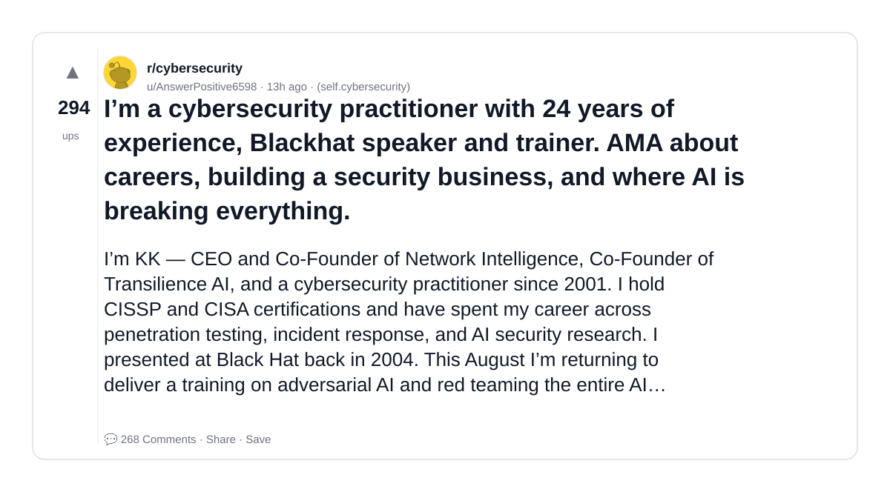
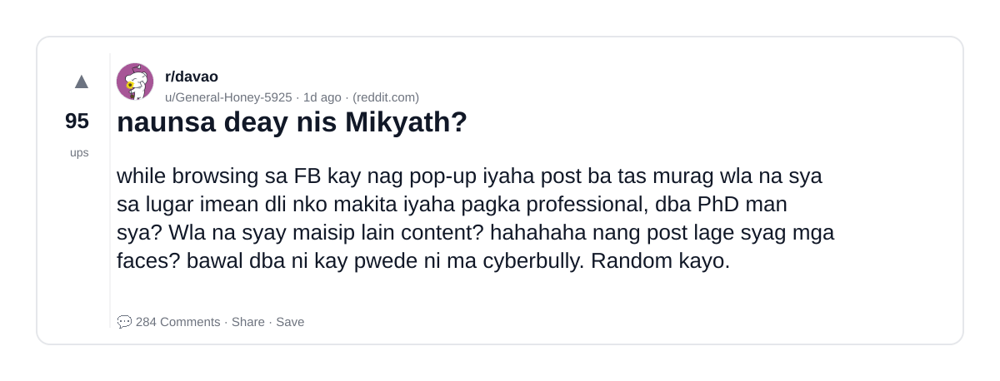
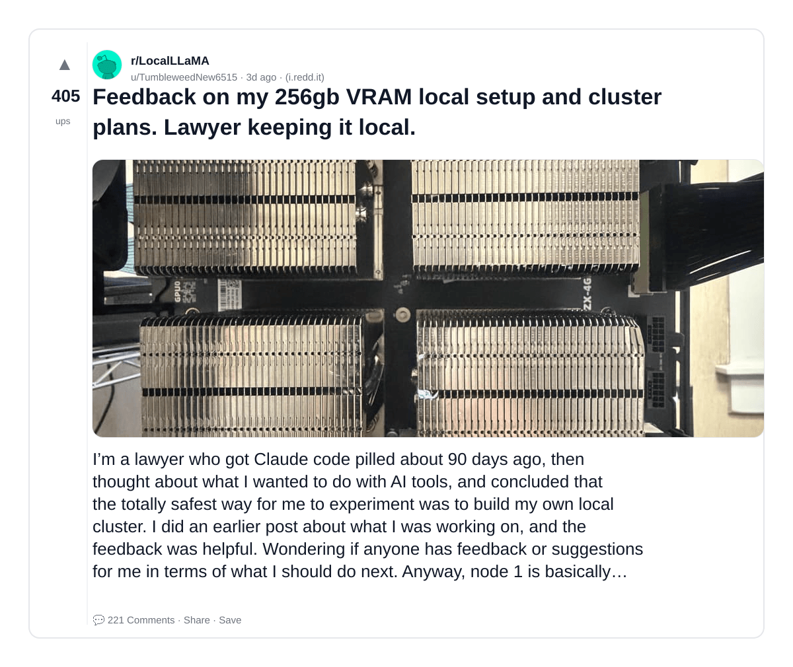
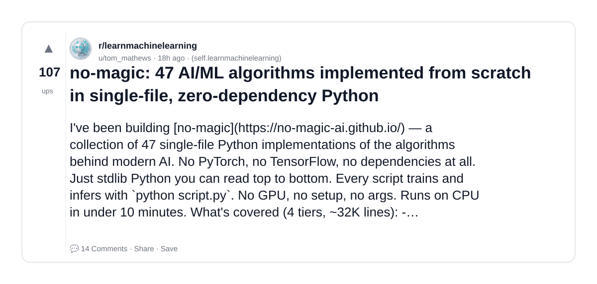
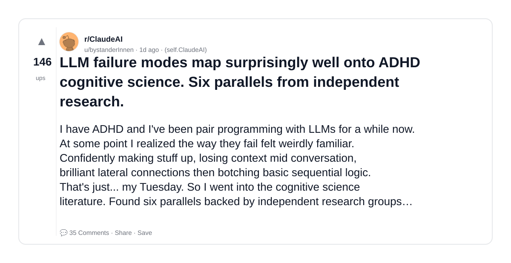
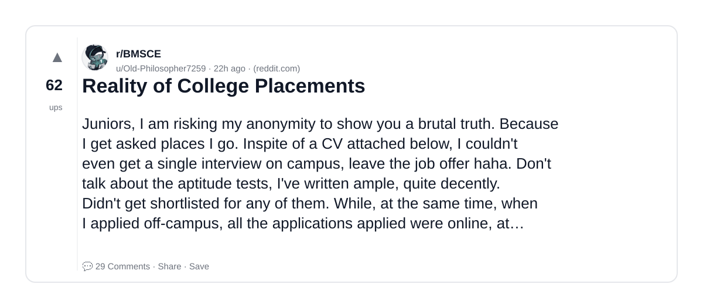
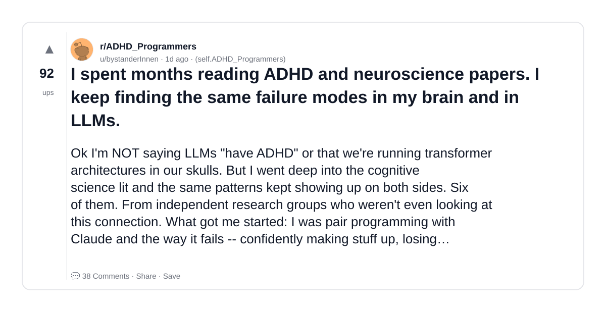
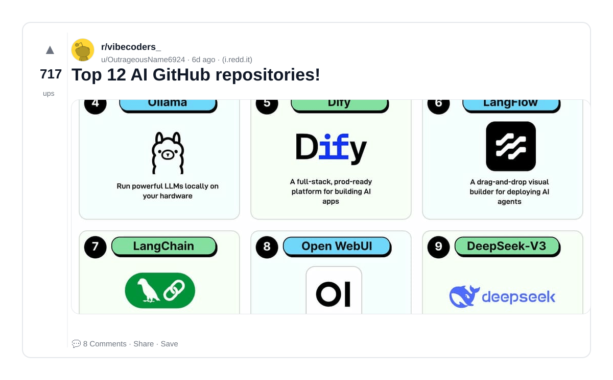
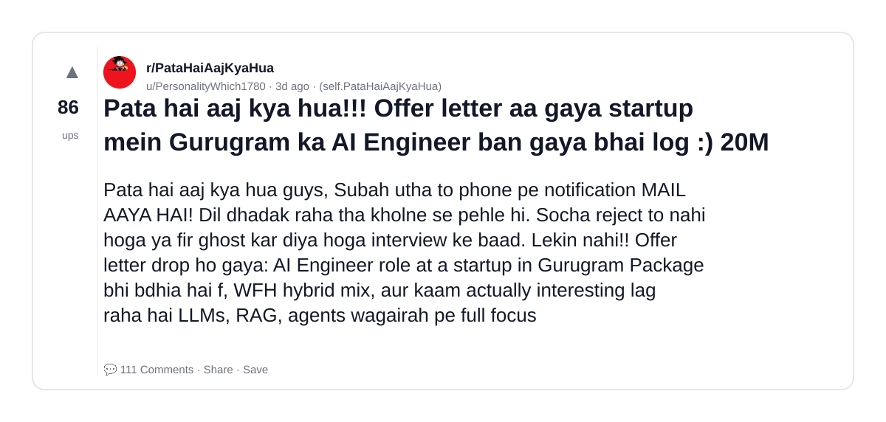
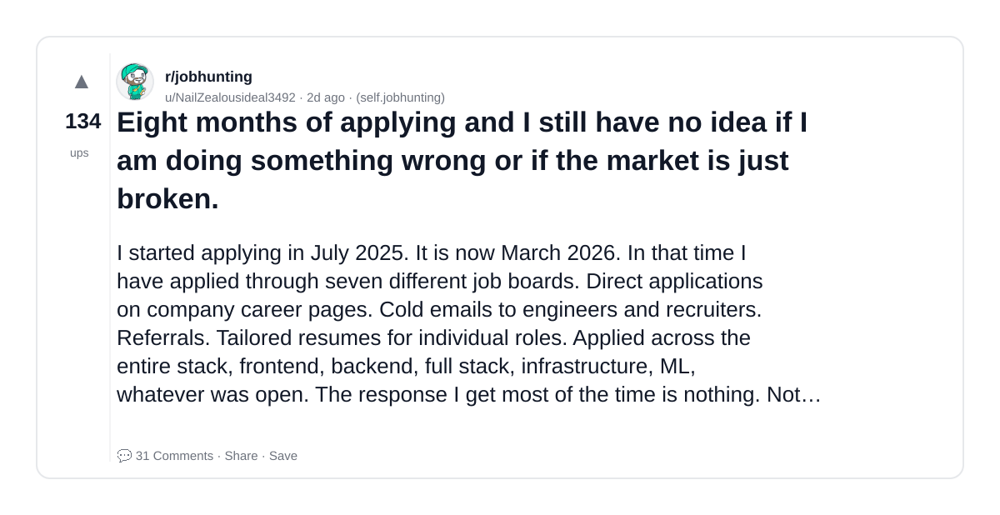

# Reddit Scout — RAG AI

Run: 2026-03-24T06-44-44-797Z
Started: 2026-03-24T06:44:44.798Z
Output dir: /home/ubuntu/.openclaw/workspace-ce/users/8176450202/reddit-scout/rag-ai/runs/2026-03-24T06-44-44-797Z

Config: topN=10 | subLimit=10 | kinds=top,hot,rising | time=week | limitPerListing=25
Search: RAG AI (sort=top t=auto)

## Top terms (from titles + top comments)

- have (9)
- make (8)
- people (7)
- into (7)
- what (6)
- more (6)
- about (5)
- llms (5)
- market (5)
- will (5)
- experience (4)
- adhd (4)
- degree (4)
- also (4)
- like (4)
- even (4)
- cybersecurity (3)
- security (3)

## Viral content ideas (derived from these posts)

**1. Personal story → timeline + receipts**
- Hook: Hook with 1 line, then a 5-step timeline; end with the lesson and what you would do differently.

**2. My have got automated: what I automated back (tools + workflow)**
- Hook: Turn it into a before/after workflow post. Include exact tool stack + steps.

**3. Checklist: how to stay valuable when make hits your team**
- Hook: A numbered checklist (10 items). Make it practical: skills, portfolio, outreach, proof-of-work.

**4. Hot take: people isn't the problem — into is**
- Hook: Contrarian framing. Back it with 2 examples from the top posts and 1 counterexample.

**5. Debunk thread: "AI will replace what" vs what's actually happening**
- Hook: Use 3 claims → 3 rebuttals. Cite specific post patterns: layoffs, hiring freezes, role shifts.

**6. Salary/market reality: more vs about roles in 2026 (Reddit signals)**
- Hook: Summarize demand signals from comments: who is struggling, who is fine, why.

**7. "What would you do in 30 days?" layoff recovery plan (day-by-day)**
- Hook: 30-day plan: portfolio, interview loops, networking, mental health. Include a downloadable checklist.

**8. Mini-case study: 1 resume bullet → 1 proof project using llms**
- Hook: Show how to convert a vague resume claim into a measurable project + writeup.

**9. Community question: which tasks should *never* be delegated to AI?**
- Hook: Ask + give your own top 5. Encourage replies; add a poll if your platform supports it.

**10. Template post: "I used AI to do X, got Y result, here's the exact prompt"**
- Hook: Make it reproducible: prompt, inputs, outputs, gotchas.

**11. Data post: a quick scorecard of the top threads (ups, comments, ratio) + what it signals**
- Hook: Table or bullets; then 3 takeaways.

**12. Meme angle (if relevant): market vs will — job search edition**
- Hook: If your niche is not memes, skip memes; otherwise caption the pattern you saw in comments.

## Top posts (10) + cards

### 1) I’m a cybersecurity practitioner with 24 years of experience, Blackhat speaker and trainer. AMA about careers, building a security business, and where AI is breaking everything.
- Subreddit: r/cybersecurity
- Viral score: 99 | Ups: 294 | Comments: 268 | Upvote ratio: 92%
- Link: https://www.reddit.com/r/cybersecurity/comments/1s1nxep/im_a_cybersecurity_practitioner_with_24_years_of/
- Card (local): ./cards/1s1nxep.png

### 2) naunsa deay nis Mikyath?
- Subreddit: r/davao
- Viral score: 41 | Ups: 95 | Comments: 284 | Upvote ratio: 89%
- Link: https://www.reddit.com/r/davao/comments/1s15lwr/naunsa_deay_nis_mikyath/
- Card (local): ./cards/1s15lwr.png

### 3) Feedback on my 256gb VRAM local setup and cluster plans. Lawyer keeping it local.
- Subreddit: r/LocalLLaMA
- Viral score: 20 | Ups: 405 | Comments: 221 | Upvote ratio: 88%
- Link: https://www.reddit.com/r/LocalLLaMA/comments/1rzg33q/feedback_on_my_256gb_vram_local_setup_and_cluster/
- Card (local): ./cards/1rzg33q.png

### 4) no-magic: 47 AI/ML algorithms implemented from scratch in single-file, zero-dependency Python
- Subreddit: r/learnmachinelearning
- Viral score: 12 | Ups: 107 | Comments: 14 | Upvote ratio: 96%
- Link: https://www.reddit.com/r/learnmachinelearning/comments/1s1frm2/nomagic_47_aiml_algorithms_implemented_from/
- Card (local): ./cards/1s1frm2.png

### 5) LLM failure modes map surprisingly well onto ADHD cognitive science. Six parallels from independent research.
- Subreddit: r/ClaudeAI
- Viral score: 11 | Ups: 146 | Comments: 35 | Upvote ratio: 93%
- Link: https://www.reddit.com/r/ClaudeAI/comments/1s0x7va/llm_failure_modes_map_surprisingly_well_onto_adhd/
- Card (local): ./cards/1s0x7va.png

### 6) Reality of College Placements
- Subreddit: r/BMSCE
- Viral score: 9 | Ups: 62 | Comments: 29 | Upvote ratio: 95%
- Link: https://www.reddit.com/r/BMSCE/comments/1s1azya/reality_of_college_placements/
- Card (local): ./cards/1s1azya.png

### 7) I spent months reading ADHD and neuroscience papers. I keep finding the same failure modes in my brain and in LLMs.
- Subreddit: r/ADHD_Programmers
- Viral score: 7 | Ups: 92 | Comments: 38 | Upvote ratio: 79%
- Link: https://www.reddit.com/r/ADHD_Programmers/comments/1s0vrxx/i_spent_months_reading_adhd_and_neuroscience/
- Card (local): ./cards/1s0vrxx.png

### 8) Top 12 AI GitHub repositories!
- Subreddit: r/vibecoders_
- Viral score: 7 | Ups: 717 | Comments: 8 | Upvote ratio: 100%
- Link: https://www.reddit.com/r/vibecoders_/comments/1rwtkt9/top_12_ai_github_repositories/
- Card (local): ./cards/1rwtkt9.png

### 9) Pata hai aaj kya hua!!! Offer letter aa gaya startup mein Gurugram ka AI Engineer ban gaya bhai log :) 20M
- Subreddit: r/PataHaiAajKyaHua
- Viral score: 6 | Ups: 86 | Comments: 111 | Upvote ratio: 95%
- Link: https://www.reddit.com/r/PataHaiAajKyaHua/comments/1rzkd8j/pata_hai_aaj_kya_hua_offer_letter_aa_gaya_startup/
- Card (local): ./cards/1rzkd8j.png

### 10) Eight months of applying and I still have no idea if I am doing something wrong or if the market is just broken.
- Subreddit: r/jobhunting
- Viral score: 6 | Ups: 134 | Comments: 31 | Upvote ratio: 98%
- Link: https://www.reddit.com/r/jobhunting/comments/1s09xbp/eight_months_of_applying_and_i_still_have_no_idea/
- Card (local): ./cards/1s09xbp.png

