# Reddit Scout — Sales Automation

Run: 2026-03-24T16-03-24-487Z
Started: 2026-03-24T16:03:24.488Z
Output dir: /home/ubuntu/.openclaw/workspace-ce/users/8176450202/reddit-scout/sales-automation/runs/2026-03-24T16-03-24-487Z

Config: topN=12 | subLimit=10 | kinds=top,hot,rising | time=all | limitPerListing=25
Search: Sales Automation (sort=top t=auto)

## Top terms (from titles + top comments)

- sales (21)
- automation (18)
- what (15)
- work (15)
- have (13)
- like (13)
- about (10)
- people (10)
- time (9)
- doesn (8)
- code (8)
- when (8)
- some (7)
- into (7)
- them (7)
- action (7)
- more (7)
- daily (6)

## Viral content ideas (derived from these posts)

**1. Personal story → timeline + receipts**
- Hook: Hook with 1 line, then a 5-step timeline; end with the lesson and what you would do differently.

**2. My sales got automated: what I automated back (tools + workflow)**
- Hook: Turn it into a before/after workflow post. Include exact tool stack + steps.

**3. Checklist: how to stay valuable when automation hits your team**
- Hook: A numbered checklist (10 items). Make it practical: skills, portfolio, outreach, proof-of-work.

**4. Hot take: what isn't the problem — work is**
- Hook: Contrarian framing. Back it with 2 examples from the top posts and 1 counterexample.

**5. Debunk thread: "AI will replace have" vs what's actually happening**
- Hook: Use 3 claims → 3 rebuttals. Cite specific post patterns: layoffs, hiring freezes, role shifts.

**6. Salary/market reality: like vs about roles in 2026 (Reddit signals)**
- Hook: Summarize demand signals from comments: who is struggling, who is fine, why.

**7. "What would you do in 30 days?" layoff recovery plan (day-by-day)**
- Hook: 30-day plan: portfolio, interview loops, networking, mental health. Include a downloadable checklist.

**8. Mini-case study: 1 resume bullet → 1 proof project using people**
- Hook: Show how to convert a vague resume claim into a measurable project + writeup.

**9. Community question: which tasks should *never* be delegated to AI?**
- Hook: Ask + give your own top 5. Encourage replies; add a poll if your platform supports it.

**10. Template post: "I used AI to do X, got Y result, here's the exact prompt"**
- Hook: Make it reproducible: prompt, inputs, outputs, gotchas.

**11. Data post: a quick scorecard of the top threads (ups, comments, ratio) + what it signals**
- Hook: Table or bullets; then 3 takeaways.

**12. Meme angle (if relevant): time vs doesn — job search edition**
- Hook: If your niche is not memes, skip memes; otherwise caption the pattern you saw in comments.

## Top posts (12) + cards

### 1) What’s the simplest automation that saved you time
- Subreddit: r/automation
- Viral score: 27 | Ups: 8 | Comments: 14 | Upvote ratio: 91%
- Link: https://www.reddit.com/r/automation/comments/1s2di0s/whats_the_simplest_automation_that_saved_you_time/
- Card (local): ./cards/1s2di0s.png

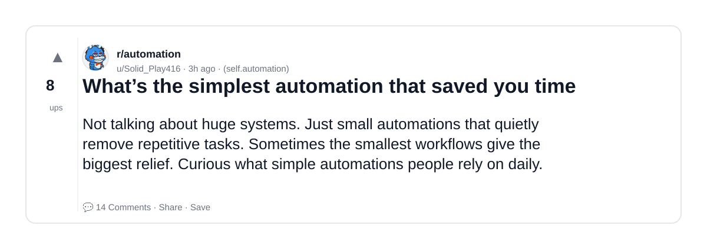

### 2) Which sales career gives the best work life balance?
- Subreddit: r/sales
- Viral score: 24 | Ups: 127 | Comments: 209 | Upvote ratio: 92%
- Link: https://www.reddit.com/r/sales/comments/1s0zvdw/which_sales_career_gives_the_best_work_life/
- Card (local): ./cards/1s0zvdw.png

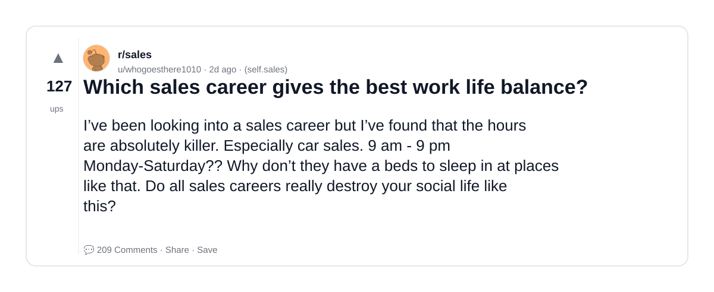

### 3) What’s the craziest automation you’ve ever built?
- Subreddit: r/automation
- Viral score: 21 | Ups: 32 | Comments: 24 | Upvote ratio: 93%
- Link: https://www.reddit.com/r/automation/comments/1s2896u/whats_the_craziest_automation_youve_ever_built/
- Card (local): ./cards/1s2896u.png

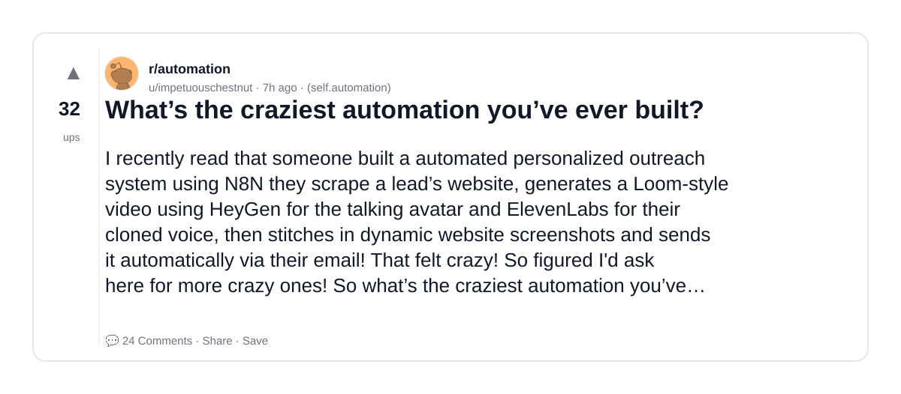

### 4) Rule #1 of home automation: never break the light switch
- Subreddit: r/homeautomation
- Viral score: 15 | Ups: 2900 | Comments: 137 | Upvote ratio: 96%
- Link: https://www.reddit.com/r/homeautomation/comments/1rp0w0r/rule_1_of_home_automation_never_break_the_light/
- Card (local): ./cards/1rp0w0r.png

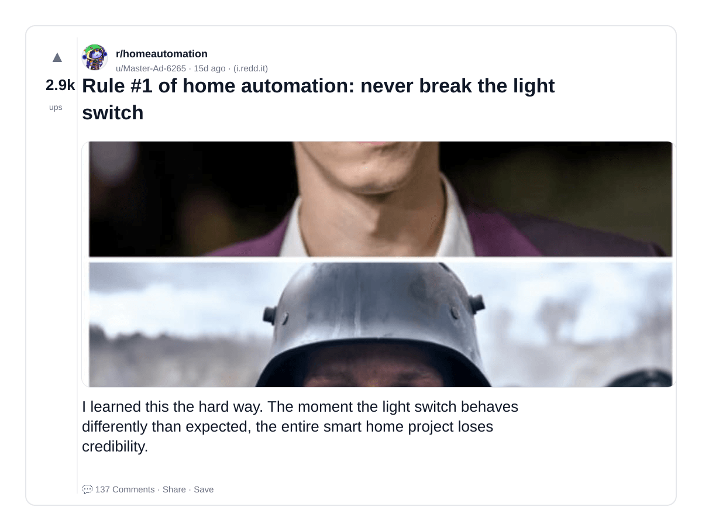

### 5) What's the automation that surprised you the most not because it was complex but because of how much it quietly changed things?
- Subreddit: r/automation
- Viral score: 13 | Ups: 14 | Comments: 13 | Upvote ratio: 94%
- Link: https://www.reddit.com/r/automation/comments/1s2a5u5/whats_the_automation_that_surprised_you_the_most/
- Card (local): ./cards/1s2a5u5.png

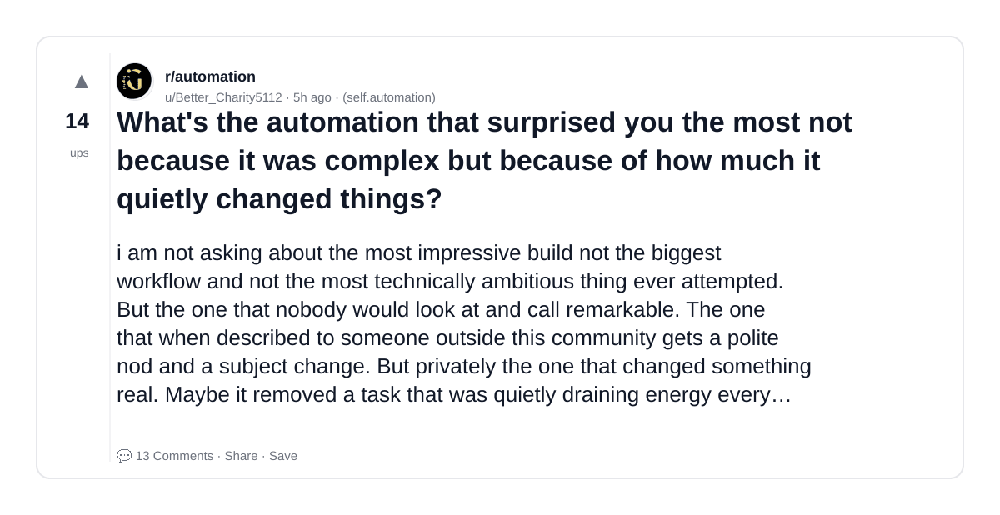

### 6) What are some books on sales that actually made a difference in your career
- Subreddit: r/sales
- Viral score: 11 | Ups: 63 | Comments: 66 | Upvote ratio: 98%
- Link: https://www.reddit.com/r/sales/comments/1s1busk/what_are_some_books_on_sales_that_actually_made_a/
- Card (local): ./cards/1s1busk.png

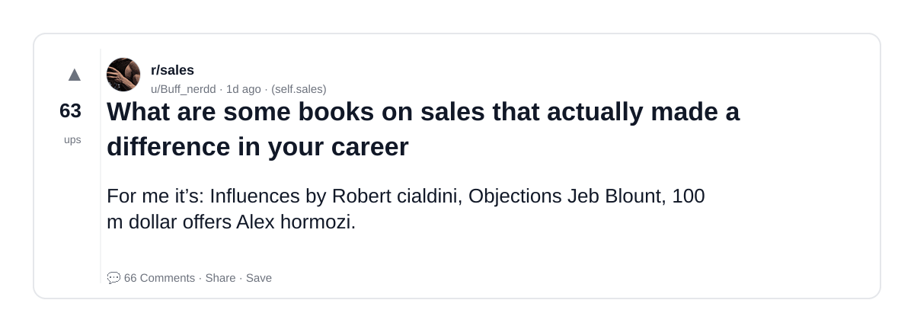

### 7) Vp of sales doesn’t want me to reassign opportunities from AE who was let go - advice needed
- Subreddit: r/sales
- Viral score: 8 | Ups: 74 | Comments: 47 | Upvote ratio: 99%
- Link: https://www.reddit.com/r/sales/comments/1s11oqo/vp_of_sales_doesnt_want_me_to_reassign/
- Card (local): ./cards/1s11oqo.png

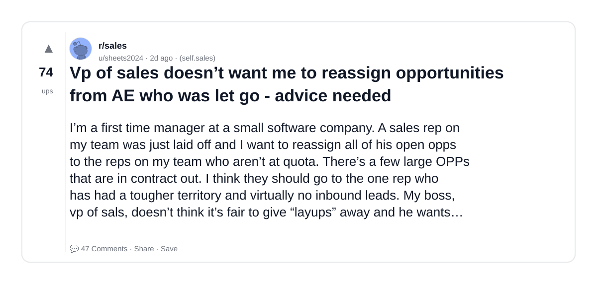

### 8) Why I’m reconsidering my stance on no-code automation services
- Subreddit: r/automation
- Viral score: 7 | Ups: 1 | Comments: 8 | Upvote ratio: 66%
- Link: https://www.reddit.com/r/automation/comments/1s2d75t/why_im_reconsidering_my_stance_on_nocode/
- Card (local): ./cards/1s2d75t.png

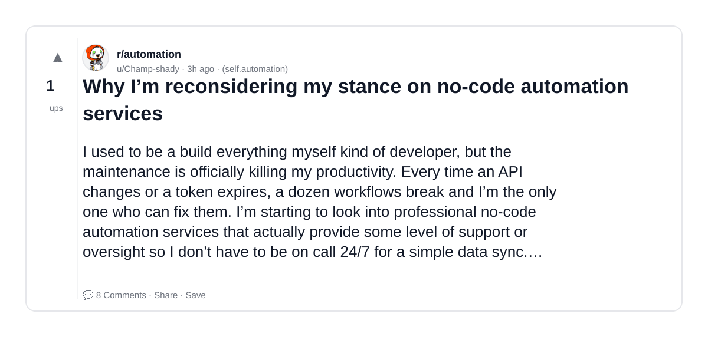

### 9) Golf and Sales
- Subreddit: r/sales
- Viral score: 6 | Ups: 89 | Comments: 108 | Upvote ratio: 89%
- Link: https://www.reddit.com/r/sales/comments/1s07lg2/golf_and_sales/
- Card (local): ./cards/1s07lg2.png

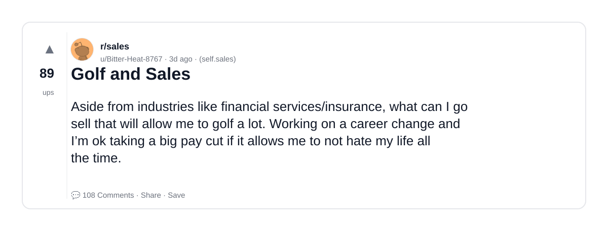

### 10) Pricing LinkedIn Automation
- Subreddit: r/n8n
- Viral score: 6 | Ups: 18 | Comments: 18 | Upvote ratio: 100%
- Link: https://www.reddit.com/r/n8n/comments/1s1zmtk/pricing_linkedin_automation/
- Card (local): ./cards/1s1zmtk.png

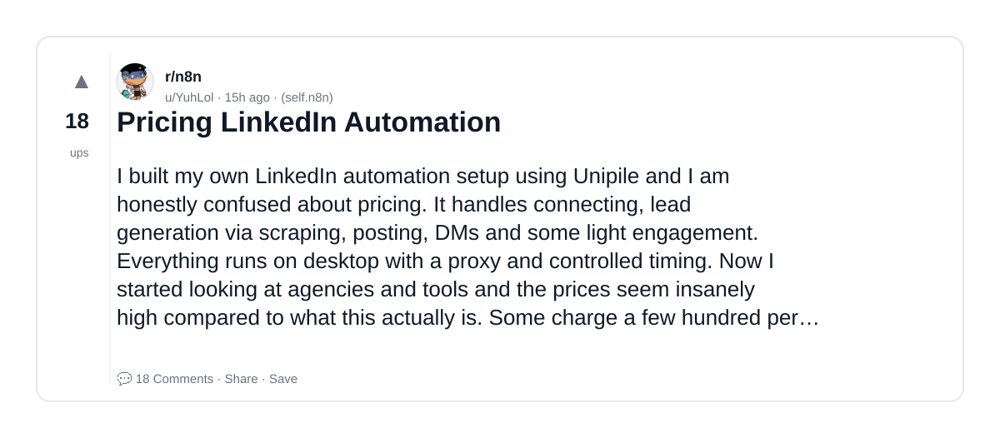

### 11) Where is the sales jobs realistically paying 300k?
- Subreddit: r/sales
- Viral score: 5 | Ups: 149 | Comments: 468 | Upvote ratio: 90%
- Link: https://www.reddit.com/r/sales/comments/1rt7v5m/where_is_the_sales_jobs_realistically_paying_300k/
- Card (local): ./cards/1rt7v5m.png

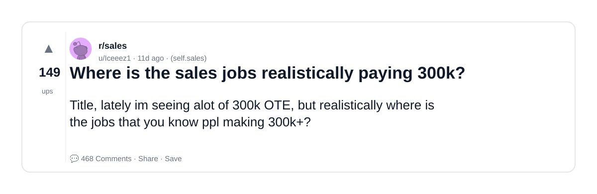

### 12) Does sales just not match my personality? Am I burned out? Undiagnosed ADHD?
- Subreddit: r/sales
- Viral score: 4 | Ups: 50 | Comments: 163 | Upvote ratio: 81%
- Link: https://www.reddit.com/r/sales/comments/1ryrj00/does_sales_just_not_match_my_personality_am_i/
- Card (local): ./cards/1ryrj00.png

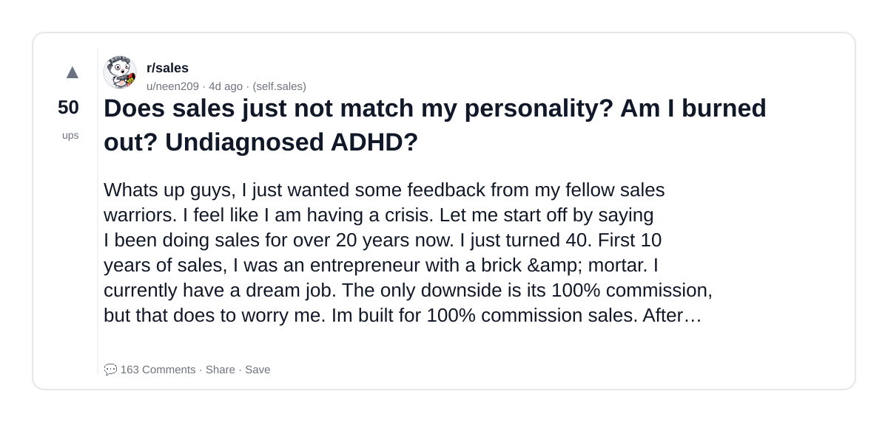
