# Reddit Scout — Sales jobs

Run: 2026-03-25T09-24-46-516Z
Started: 2026-03-25T09:24:46.517Z
Output dir: /home/ubuntu/.openclaw/workspace-ce/users/8176450202/reddit-scout/sales-jobs/runs/2026-03-25T09-24-46-516Z

Config: topN=30 | subLimit=15 | kinds=top,hot,rising | time=month | limitPerListing=25
Search: Sales jobs (sort=top t=auto)

## Top terms (from titles + top comments)

- sales (21)
- jobs (10)
- actually (4)
- what (4)
- years (3)
- doing (3)
- 2026 (3)
- career (3)
- paying (2)
- cash (2)
- thing (2)
- still (2)
- people (2)
- applied (2)
- applying (2)
- weeks (2)
- later (2)
- most (2)

## Viral content ideas (derived from these posts)

**1. Personal story → timeline + receipts**
- Hook: Hook with 1 line, then a 5-step timeline; end with the lesson and what you would do differently.

**2. My sales got automated: what I automated back (tools + workflow)**
- Hook: Turn it into a before/after workflow post. Include exact tool stack + steps.

**3. Checklist: how to stay valuable when jobs hits your team**
- Hook: A numbered checklist (10 items). Make it practical: skills, portfolio, outreach, proof-of-work.

**4. Hot take: actually isn't the problem — what is**
- Hook: Contrarian framing. Back it with 2 examples from the top posts and 1 counterexample.

**5. Debunk thread: "AI will replace years" vs what's actually happening**
- Hook: Use 3 claims → 3 rebuttals. Cite specific post patterns: layoffs, hiring freezes, role shifts.

**6. Salary/market reality: doing vs 2026 roles in 2026 (Reddit signals)**
- Hook: Summarize demand signals from comments: who is struggling, who is fine, why.

**7. "What would you do in 30 days?" layoff recovery plan (day-by-day)**
- Hook: 30-day plan: portfolio, interview loops, networking, mental health. Include a downloadable checklist.

**8. Mini-case study: 1 resume bullet → 1 proof project using career**
- Hook: Show how to convert a vague resume claim into a measurable project + writeup.

**9. Community question: which tasks should *never* be delegated to AI?**
- Hook: Ask + give your own top 5. Encourage replies; add a poll if your platform supports it.

**10. Template post: "I used AI to do X, got Y result, here's the exact prompt"**
- Hook: Make it reproducible: prompt, inputs, outputs, gotchas.

**11. Data post: a quick scorecard of the top threads (ups, comments, ratio) + what it signals**
- Hook: Table or bullets; then 3 takeaways.

**12. Meme angle (if relevant): paying vs cash — job search edition**
- Hook: If your niche is not memes, skip memes; otherwise caption the pattern you saw in comments.

## Top posts (30) + cards

### 1) Sales guy completely changed once I mentioned I was paying cash, is that actually a thing?
- Subreddit: r/askcarsales
- Viral score: 88 | Ups: 189 | Comments: 145 | Upvote ratio: 88%
- Link: https://www.reddit.com/r/askcarsales/comments/1s2qc9e/sales_guy_completely_changed_once_i_mentioned_i/
- Card (local): ./cards/1s2qc9e.png

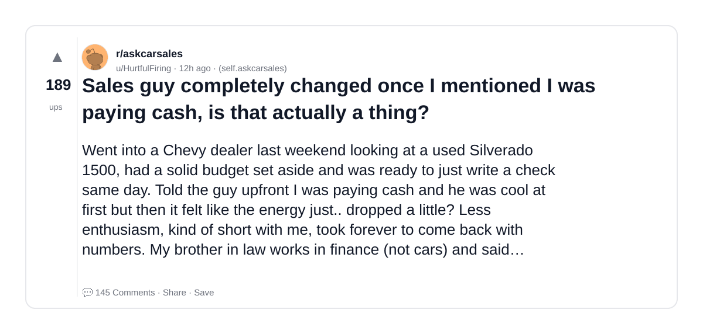

### 2) 10 years in sales and I still get jealous of tech people sometimes (software eng, data science, AI, AWS etc.)
- Subreddit: r/sales
- Viral score: 66 | Ups: 25 | Comments: 74 | Upvote ratio: 78%
- Link: https://www.reddit.com/r/sales/comments/1s30q36/10_years_in_sales_and_i_still_get_jealous_of_tech/
- Card (local): ./cards/1s30q36.png

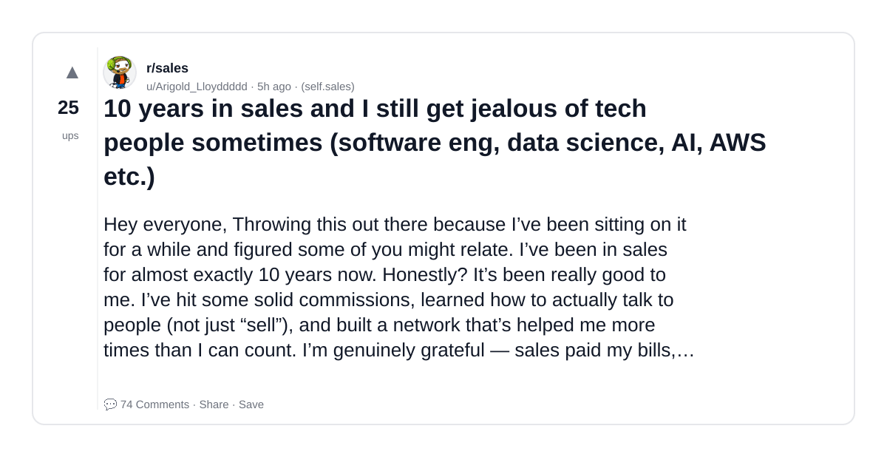

### 3) Applied to 40 jobs in 3 months. Only 3 called back. Is something broken or is it just me?
- Subreddit: r/jobsearchhacks
- Viral score: 41 | Ups: 28 | Comments: 35 | Upvote ratio: 89%
- Link: https://www.reddit.com/r/jobsearchhacks/comments/1s311l6/applied_to_40_jobs_in_3_months_only_3_called_back/
- Card (local): ./cards/1s311l6.png

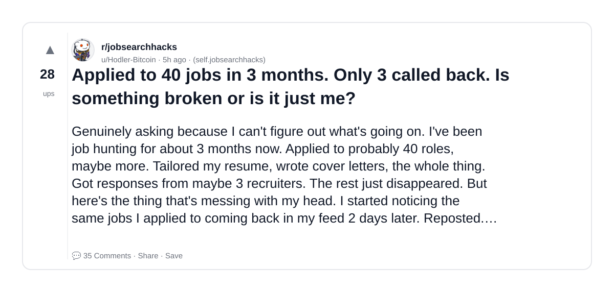

### 4) Companies are posting fake jobs to figure out how little they can pay you.
- Subreddit: r/jobsearchhacks
- Viral score: 29 | Ups: 222 | Comments: 22 | Upvote ratio: 97%
- Link: https://www.reddit.com/r/jobsearchhacks/comments/1s2eo3g/companies_are_posting_fake_jobs_to_figure_out_how/
- Card (local): ./cards/1s2eo3g.png

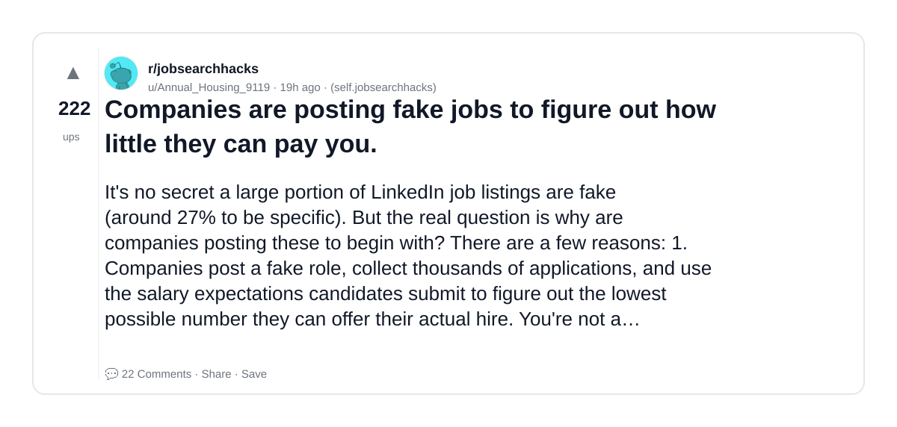

### 5) Stopped applying to jobs on LinkedIn and started doing this one thing instead - got an offer in 3 weeks
- Subreddit: r/jobsearchhacks
- Viral score: 22 | Ups: 5060 | Comments: 271 | Upvote ratio: 93%
- Link: https://www.reddit.com/r/jobsearchhacks/comments/1rmkg9a/stopped_applying_to_jobs_on_linkedin_and_started/
- Card (local): ./cards/1rmkg9a.png

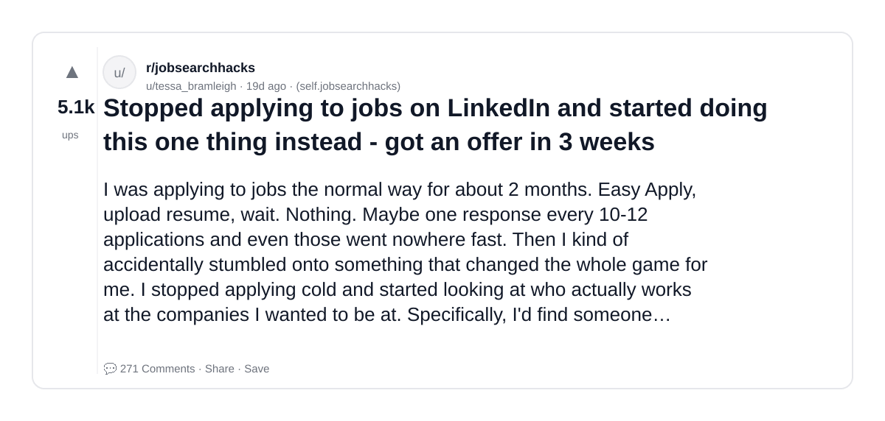

### 6) How I ended up making good money doing sales (and why I still do it 10 years later)
- Subreddit: r/sales
- Viral score: 17 | Ups: 34 | Comments: 19 | Upvote ratio: 90%
- Link: https://www.reddit.com/r/sales/comments/1s2xdnc/how_i_ended_up_making_good_money_doing_sales_and/
- Card (local): ./cards/1s2xdnc.png

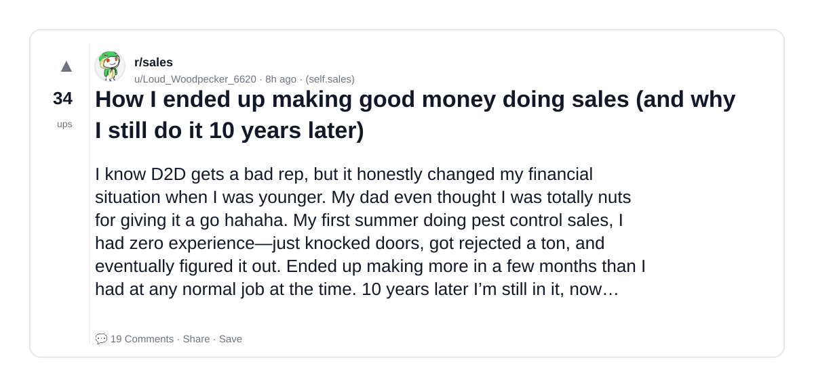

### 7) Are dealerships actually struggling in 2026 or is it just a sales tactic?
- Subreddit: r/askcarsales
- Viral score: 14 | Ups: 87 | Comments: 108 | Upvote ratio: 87%
- Link: https://www.reddit.com/r/askcarsales/comments/1s1syk8/are_dealerships_actually_struggling_in_2026_or_is/
- Card (local): ./cards/1s1syk8.png

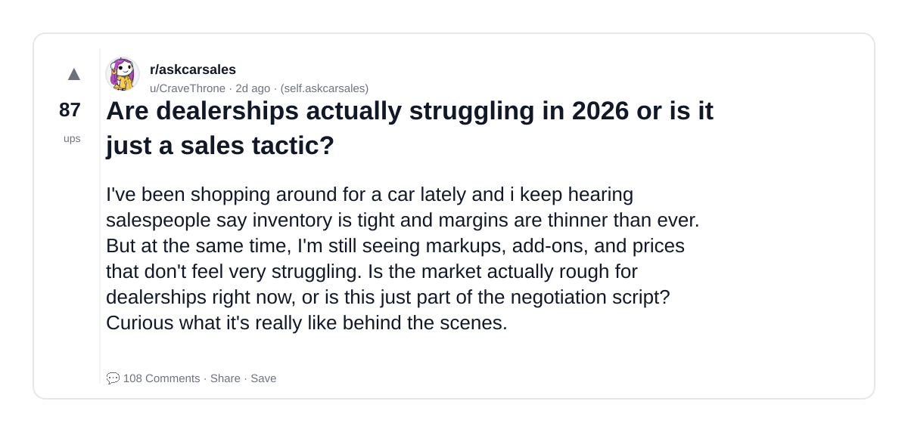

### 8) Which sales career gives the best work life balance?
- Subreddit: r/sales
- Viral score: 13 | Ups: 136 | Comments: 209 | Upvote ratio: 92%
- Link: https://www.reddit.com/r/sales/comments/1s0zvdw/which_sales_career_gives_the_best_work_life/
- Card (local): ./cards/1s0zvdw.png

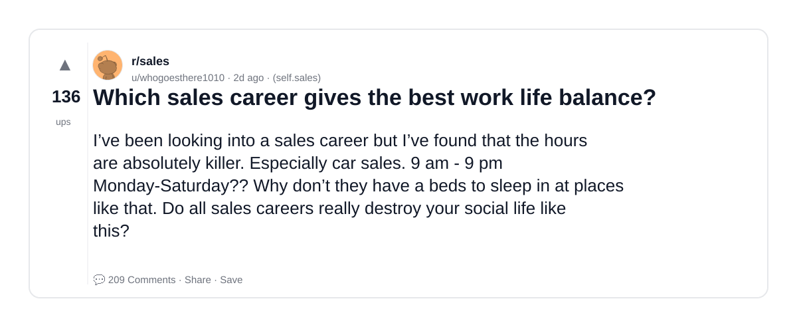

### 9) What actually improved your sales soft skills the most?
- Subreddit: r/salestechniques
- Viral score: 12 | Ups: 5 | Comments: 5 | Upvote ratio: 100%
- Link: https://www.reddit.com/r/salestechniques/comments/1s33v1w/what_actually_improved_your_sales_soft_skills_the/
- Card (local): ./cards/1s33v1w.png

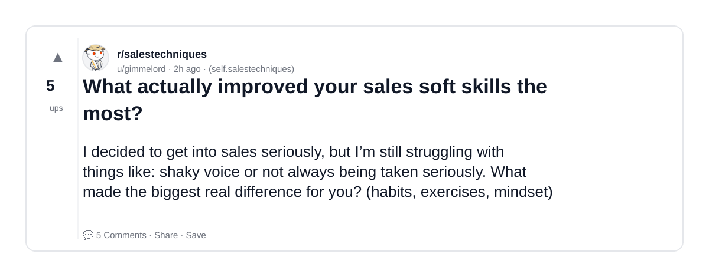

### 10) I have one of those "Do nothing jobs" and I've been talked to about not doing anything.
- Subreddit: r/jobs
- Viral score: 7 | Ups: 2002 | Comments: 185 | Upvote ratio: 98%
- Link: https://www.reddit.com/r/jobs/comments/1rjpokk/i_have_one_of_those_do_nothing_jobs_and_ive_been/
- Card (local): ./cards/1rjpokk.png

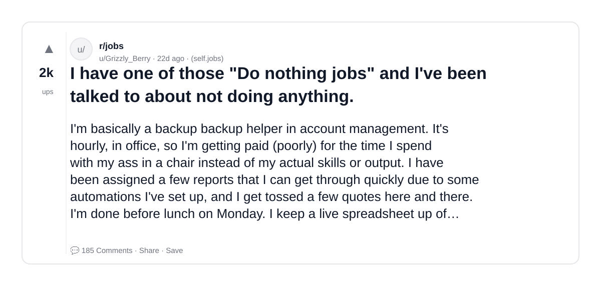

### 11) U.S. Lost 92,000 Jobs in February
- Subreddit: r/jobs
- Viral score: 7 | Ups: 1509 | Comments: 218 | Upvote ratio: 98%
- Link: https://www.reddit.com/r/jobs/comments/1rme74f/us_lost_92000_jobs_in_february/
- Card (local): ./cards/1rme74f.png

### 12) What are some books on sales that actually made a difference in your career
- Subreddit: r/sales
- Viral score: 7 | Ups: 62 | Comments: 68 | Upvote ratio: 97%
- Link: https://www.reddit.com/r/sales/comments/1s1busk/what_are_some_books_on_sales_that_actually_made_a/
- Card (local): ./cards/1s1busk.png

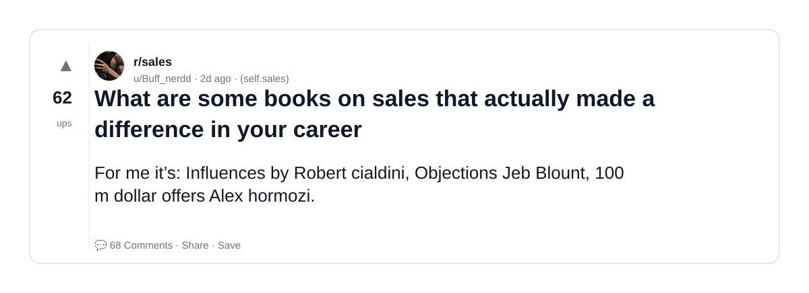

### 13) Internal bureaucracy is getting out of hand in sales
- Subreddit: r/sales
- Viral score: 5 | Ups: 14 | Comments: 7 | Upvote ratio: 100%
- Link: https://www.reddit.com/r/sales/comments/1s2vr7j/internal_bureaucracy_is_getting_out_of_hand_in/
- Card (local): ./cards/1s2vr7j.png

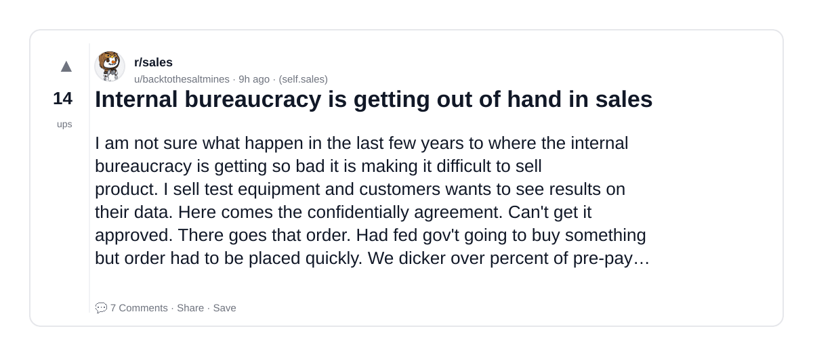

### 14) There are people less experienced than you starting jobs you applied for
- Subreddit: r/jobsearchhacks
- Viral score: 5 | Ups: 920 | Comments: 56 | Upvote ratio: 94%
- Link: https://www.reddit.com/r/jobsearchhacks/comments/1rr18qd/there_are_people_less_experienced_than_you/
- Card (local): ./cards/1rr18qd.png

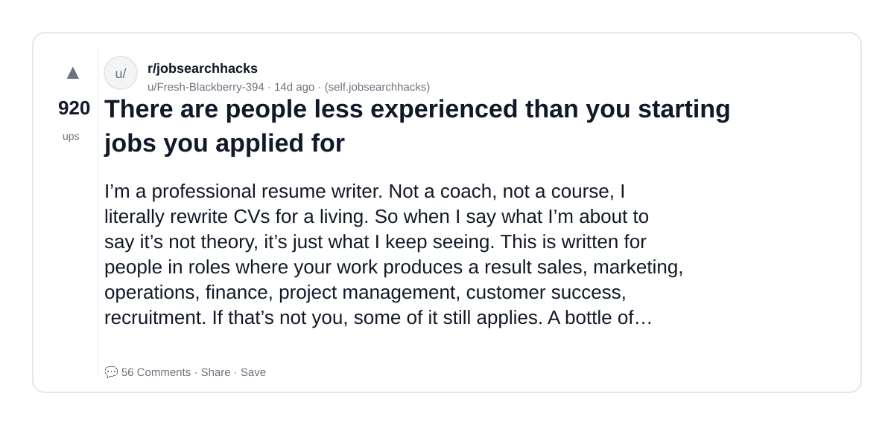

### 15) Where is the sales jobs realistically paying 300k?
- Subreddit: r/sales
- Viral score: 4 | Ups: 149 | Comments: 468 | Upvote ratio: 90%
- Link: https://www.reddit.com/r/sales/comments/1rt7v5m/where_is_the_sales_jobs_realistically_paying_300k/
- Card (local): ./cards/1rt7v5m.png

### 16) Books for pre sales SA
- Subreddit: r/salesengineers
- Viral score: 4 | Ups: 14 | Comments: 20 | Upvote ratio: 94%
- Link: https://www.reddit.com/r/salesengineers/comments/1s2ego4/books_for_pre_sales_sa/
- Card (local): ./cards/1s2ego4.png

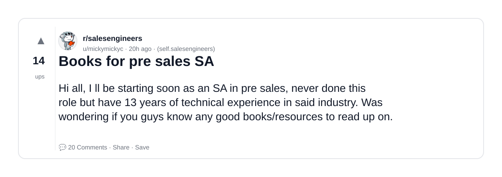

### 17) Anyone in cyber security sales?
- Subreddit: r/techsales
- Viral score: 4 | Ups: 0 | Comments: 35 | Upvote ratio: 50%
- Link: https://www.reddit.com/r/techsales/comments/1s2f6sb/anyone_in_cyber_security_sales/
- Card (local): ./cards/1s2f6sb.png

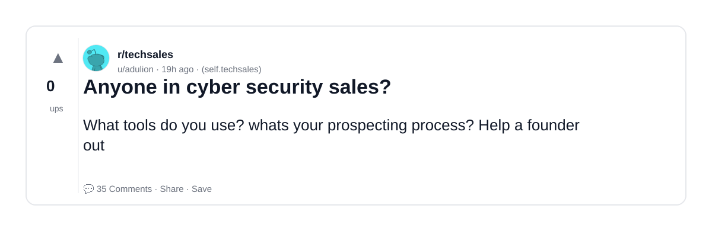

### 18) First sales opportunity
- Subreddit: r/sales
- Viral score: 3 | Ups: 3 | Comments: 4 | Upvote ratio: 100%
- Link: https://www.reddit.com/r/sales/comments/1s31atv/first_sales_opportunity/
- Card (local): ./cards/1s31atv.png

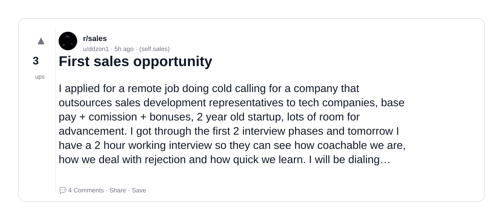

### 19) Told sales rep I didn’t want to sign up for the Jeep app. They contacted me later urgently requesting me to do it. Then they registered me without my consent.
- Subreddit: r/askcarsales
- Viral score: 3 | Ups: 583 | Comments: 419 | Upvote ratio: 93%
- Link: https://www.reddit.com/r/askcarsales/comments/1rjg3n6/told_sales_rep_i_didnt_want_to_sign_up_for_the/
- Card (local): ./cards/1rjg3n6.png

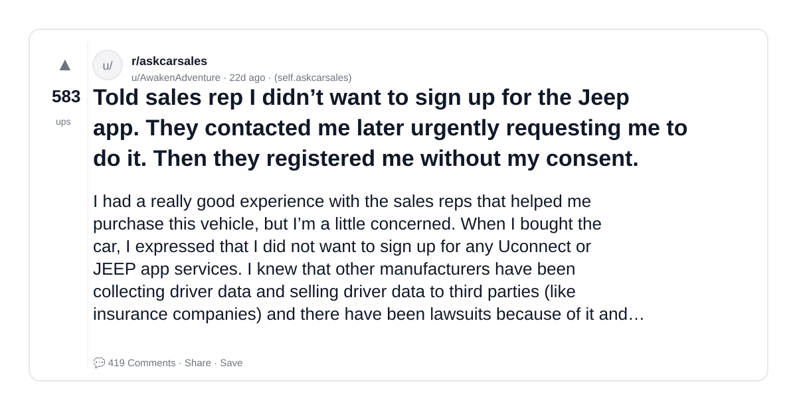

### 20) Sales 'enablement'
- Subreddit: r/techsales
- Viral score: 3 | Ups: 27 | Comments: 28 | Upvote ratio: 94%
- Link: https://www.reddit.com/r/techsales/comments/1s1oa0b/sales_enablement/
- Card (local): ./cards/1s1oa0b.png

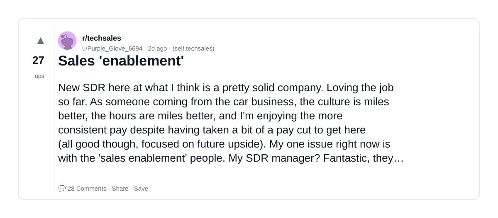

### 21) The most effective job search advice I ever got was to stop applying to jobs entirely for two weeks. It sounds insane. It worked
- Subreddit: r/jobsearchhacks
- Viral score: 3 | Ups: 790 | Comments: 64 | Upvote ratio: 92%
- Link: https://www.reddit.com/r/jobsearchhacks/comments/1rnczyl/the_most_effective_job_search_advice_i_ever_got/
- Card (local): ./cards/1rnczyl.png

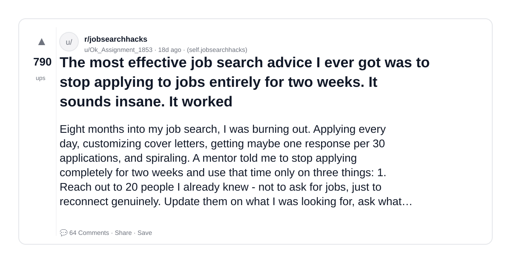

### 22) 2026 taking a wicked turn - I just accepted a D2D sales role
- Subreddit: r/sales
- Viral score: 2 | Ups: 13 | Comments: 4 | Upvote ratio: 88%
- Link: https://www.reddit.com/r/sales/comments/1s2rpei/2026_taking_a_wicked_turn_i_just_accepted_a_d2d/
- Card (local): ./cards/1s2rpei.png

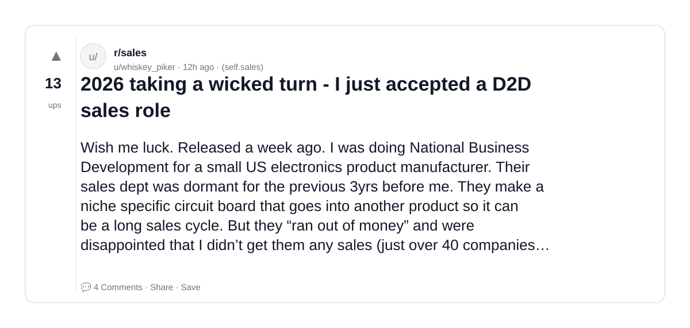

### 23) After 9 years in B2B sales ($1.3M cash comp) these are the 9 things that made the biggest difference.
- Subreddit: r/sales
- Viral score: 2 | Ups: 321 | Comments: 87 | Upvote ratio: 96%
- Link: https://www.reddit.com/r/sales/comments/1rsozeb/after_9_years_in_b2b_sales_13m_cash_comp_these/
- Card (local): ./cards/1rsozeb.png

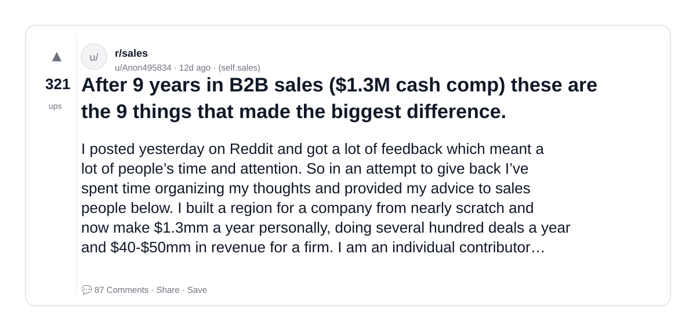

### 24) Transitioning to sales
- Subreddit: r/salesengineers
- Viral score: 2 | Ups: 0 | Comments: 19 | Upvote ratio: 50%
- Link: https://www.reddit.com/r/salesengineers/comments/1s2ksj1/transitioning_to_sales/
- Card (local): ./cards/1s2ksj1.png

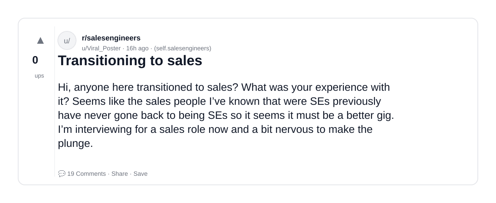

### 25) Remote Jobs That Opened Today (24/03/2026) – USA
- Subreddit: r/RemoteJobs
- Viral score: 2 | Ups: 20 | Comments: 2 | Upvote ratio: 86%
- Link: https://www.reddit.com/r/RemoteJobs/comments/1s2n8b0/remote_jobs_that_opened_today_24032026_usa/
- Card (local): ./cards/1s2n8b0.png

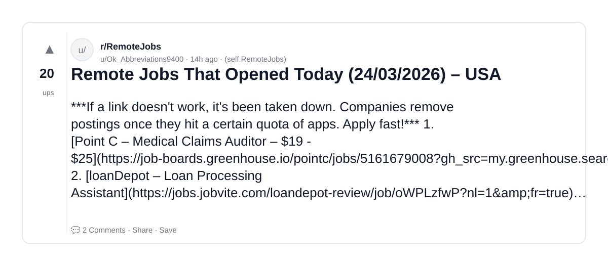

### 26) The absolute worst sales guru out there?
- Subreddit: r/sales
- Viral score: 2 | Ups: 133 | Comments: 369 | Upvote ratio: 89%
- Link: https://www.reddit.com/r/sales/comments/1rltz6j/the_absolute_worst_sales_guru_out_there/
- Card (local): ./cards/1rltz6j.png

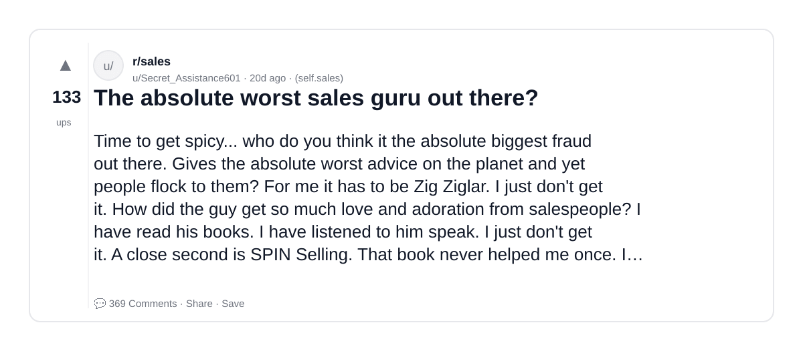

### 27) Sales Career Direction?(long post)
- Subreddit: r/sales
- Viral score: 2 | Ups: 3 | Comments: 21 | Upvote ratio: 100%
- Link: https://www.reddit.com/r/sales/comments/1s1zft6/sales_career_directionlong_post/
- Card (local): ./cards/1s1zft6.png

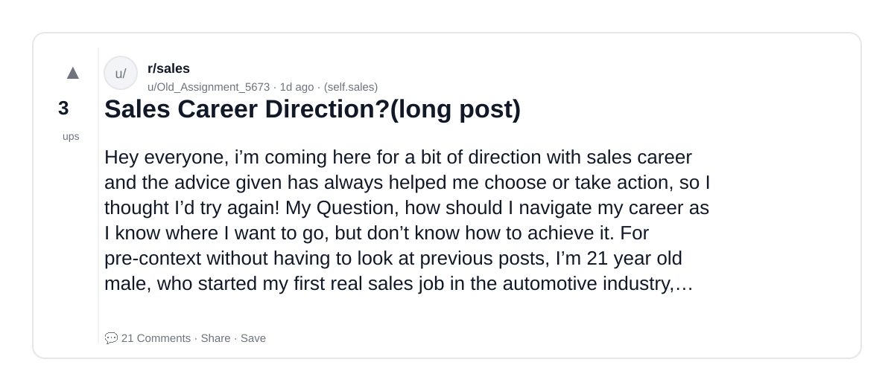

### 28) Multilingual here What Remote Jobs Should I Target?
- Subreddit: r/RemoteJobs
- Viral score: 1 | Ups: 7 | Comments: 4 | Upvote ratio: 100%
- Link: https://www.reddit.com/r/RemoteJobs/comments/1s2nhzx/multilingual_here_what_remote_jobs_should_i_target/
- Card (local): ./cards/1s2nhzx.png

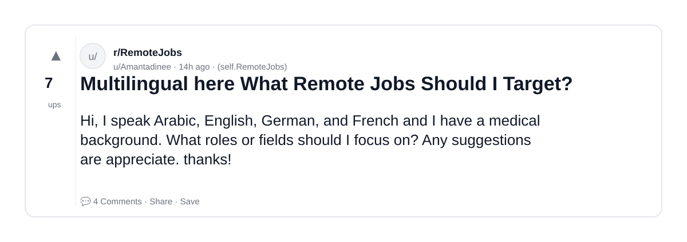

### 29) Sales enablement
- Subreddit: r/techsales
- Viral score: 1 | Ups: 3 | Comments: 19 | Upvote ratio: 100%
- Link: https://www.reddit.com/r/techsales/comments/1s1sq1u/sales_enablement/
- Card (local): ./cards/1s1sq1u.png

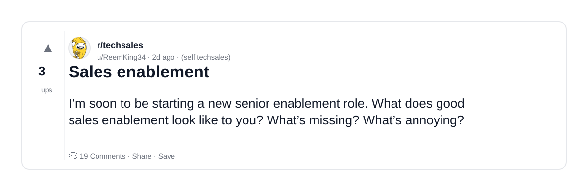

### 30) High earners, what’s a typical sales process like?
- Subreddit: r/salestechniques
- Viral score: 1 | Ups: 100 | Comments: 50 | Upvote ratio: 95%
- Link: https://www.reddit.com/r/salestechniques/comments/1ruxxn8/high_earners_whats_a_typical_sales_process_like/
- Card (local): ./cards/1ruxxn8.png

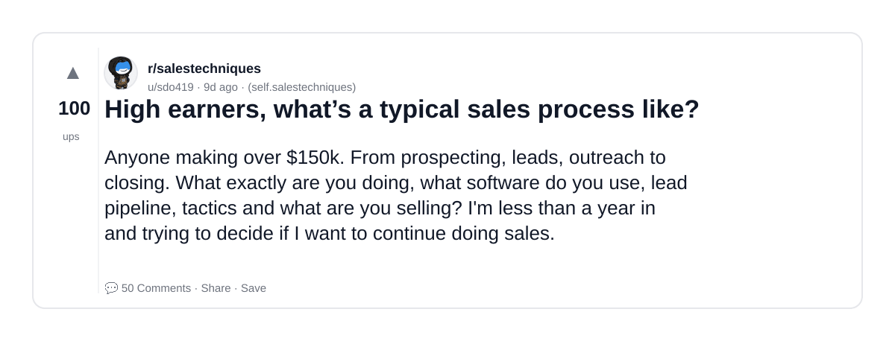
