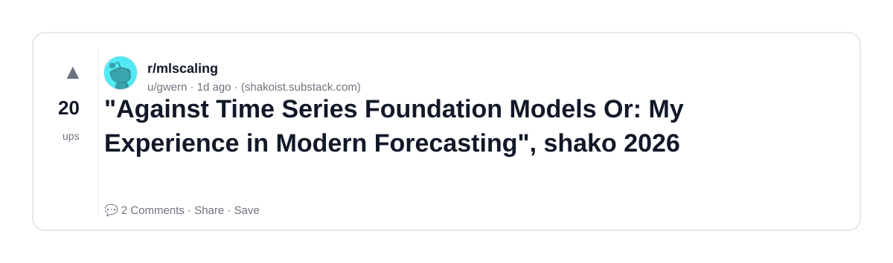
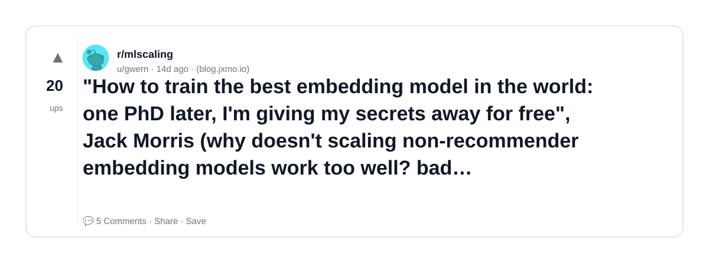
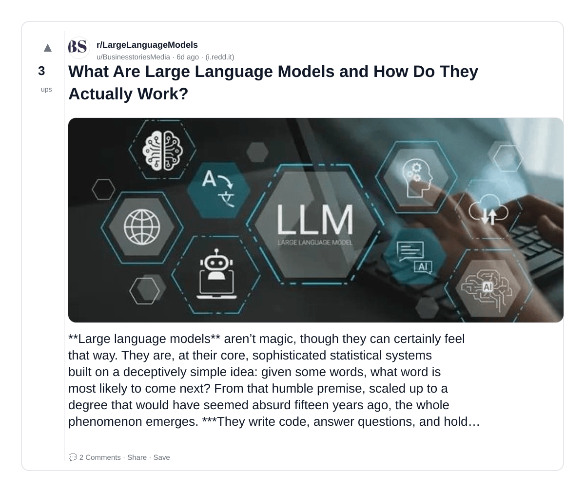
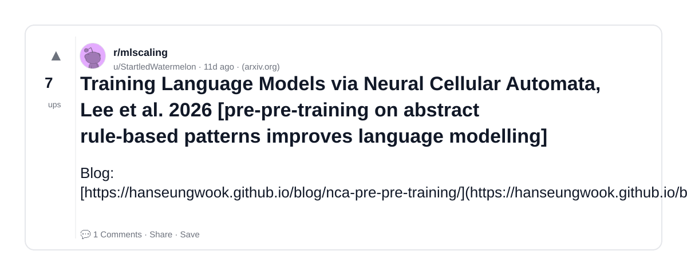
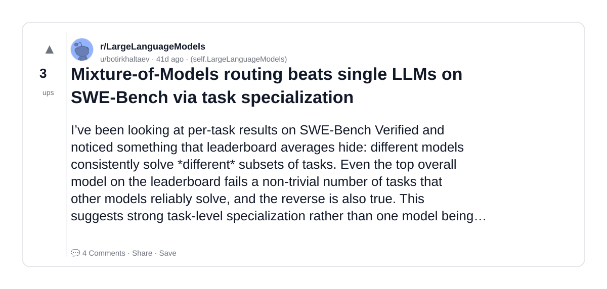
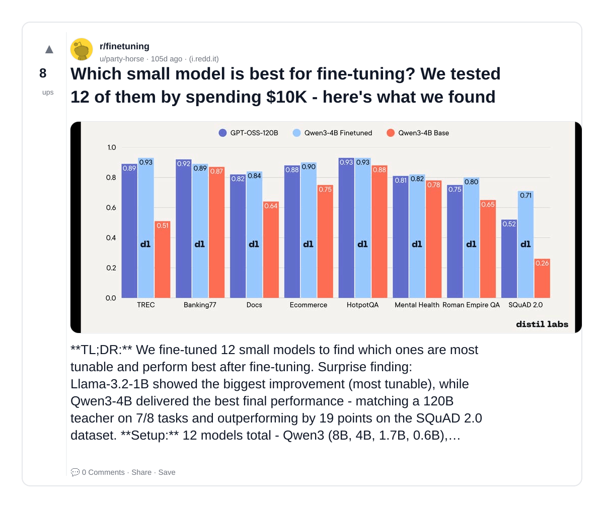
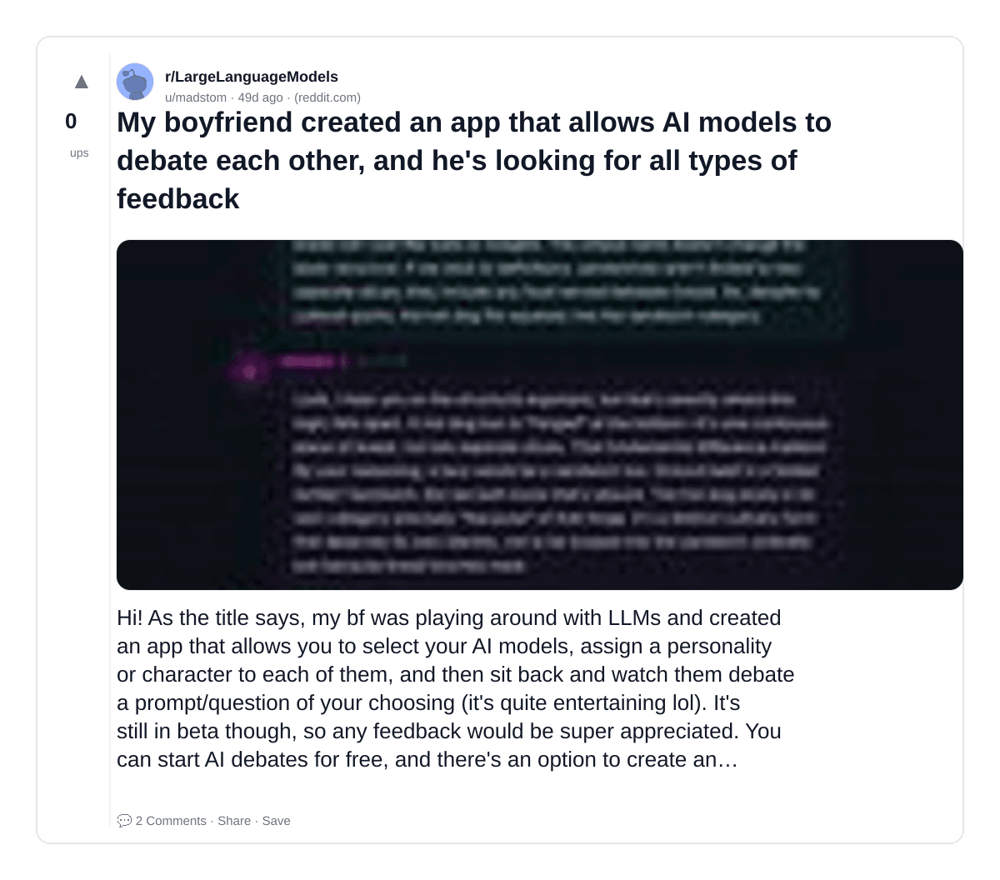
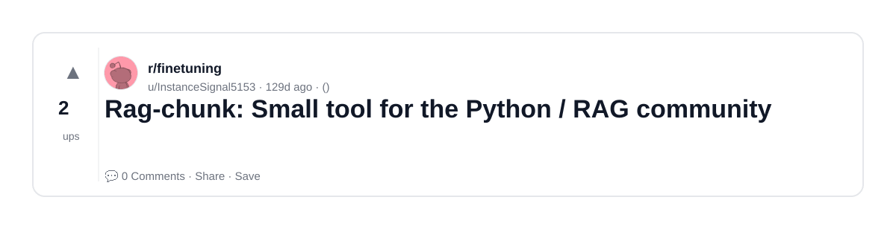
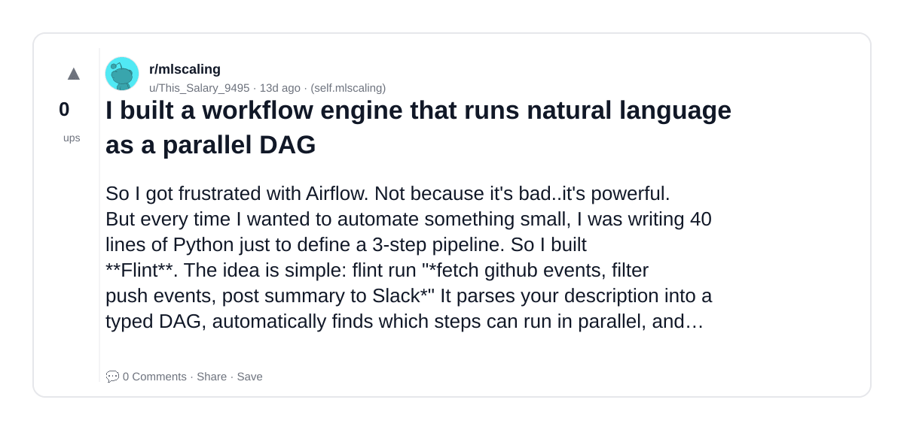

# Reddit Scout — Small Language Models

Run: 2026-03-24T12-11-55-523Z
Started: 2026-03-24T12:11:55.524Z
Output dir: /home/ubuntu/.openclaw/workspace-ce/users/8176450202/reddit-scout/small-language-models/runs/2026-03-24T12-11-55-523Z

Config: topN=20 | subLimit=12 | kinds=top,hot,rising | time=week | limitPerListing=25
Search: Small Language Models (sort=top t=auto)

## Top terms (from titles + top comments)

- models (13)
- language (7)
- data (5)
- model (4)
- work (4)
- what (4)
- large (4)
- metric (4)
- like (4)
- them (3)
- other (3)
- tsfm (3)
- https (3)
- foundation (2)
- forecasting (2)
- 2026 (2)
- best (2)
- embedding (2)

## Viral content ideas (derived from these posts)

**1. Personal story → timeline + receipts**
- Hook: Hook with 1 line, then a 5-step timeline; end with the lesson and what you would do differently.

**2. My models got automated: what I automated back (tools + workflow)**
- Hook: Turn it into a before/after workflow post. Include exact tool stack + steps.

**3. Checklist: how to stay valuable when language hits your team**
- Hook: A numbered checklist (10 items). Make it practical: skills, portfolio, outreach, proof-of-work.

**4. Hot take: data isn't the problem — model is**
- Hook: Contrarian framing. Back it with 2 examples from the top posts and 1 counterexample.

**5. Debunk thread: "AI will replace work" vs what's actually happening**
- Hook: Use 3 claims → 3 rebuttals. Cite specific post patterns: layoffs, hiring freezes, role shifts.

**6. Salary/market reality: what vs large roles in 2026 (Reddit signals)**
- Hook: Summarize demand signals from comments: who is struggling, who is fine, why.

**7. "What would you do in 30 days?" layoff recovery plan (day-by-day)**
- Hook: 30-day plan: portfolio, interview loops, networking, mental health. Include a downloadable checklist.

**8. Mini-case study: 1 resume bullet → 1 proof project using metric**
- Hook: Show how to convert a vague resume claim into a measurable project + writeup.

**9. Community question: which tasks should *never* be delegated to AI?**
- Hook: Ask + give your own top 5. Encourage replies; add a poll if your platform supports it.

**10. Template post: "I used AI to do X, got Y result, here's the exact prompt"**
- Hook: Make it reproducible: prompt, inputs, outputs, gotchas.

**11. Data post: a quick scorecard of the top threads (ups, comments, ratio) + what it signals**
- Hook: Table or bullets; then 3 takeaways.

**12. Meme angle (if relevant): like vs them — job search edition**
- Hook: If your niche is not memes, skip memes; otherwise caption the pattern you saw in comments.

## Top posts (9) + cards

### 1) "Against Time Series Foundation Models Or: My Experience in Modern Forecasting", shako 2026
- Subreddit: r/mlscaling
- Viral score: 1 | Ups: 20 | Comments: 2 | Upvote ratio: 92%
- Link: https://www.reddit.com/r/mlscaling/comments/1s15cd4/against_time_series_foundation_models_or_my/
- Card (local): ./cards/1s15cd4.png

### 2) "How to train the best embedding model in the world: one PhD later, I'm giving my secrets away for free", Jack Morris (why doesn't scaling non-recommender embedding models work too well? bad gradients/optimization)
- Subreddit: r/mlscaling
- Viral score: 0 | Ups: 20 | Comments: 5 | Upvote ratio: 83%
- Link: https://www.reddit.com/r/mlscaling/comments/1rq5y05/how_to_train_the_best_embedding_model_in_the/
- Card (local): ./cards/1rq5y05.png

### 3) What Are Large Language Models and How Do They Actually Work?
- Subreddit: r/LargeLanguageModels
- Viral score: 0 | Ups: 3 | Comments: 2 | Upvote ratio: 81%
- Link: https://www.reddit.com/r/LargeLanguageModels/comments/1rx0rdh/what_are_large_language_models_and_how_do_they/
- Card (local): ./cards/1rx0rdh.png

### 4) Training Language Models via Neural Cellular Automata, Lee et al. 2026 [pre-pre-training on abstract rule-based patterns improves language modelling]
- Subreddit: r/mlscaling
- Viral score: 0 | Ups: 7 | Comments: 1 | Upvote ratio: 82%
- Link: https://www.reddit.com/r/mlscaling/comments/1rsp23c/training_language_models_via_neural_cellular/
- Card (local): ./cards/1rsp23c.png

### 5) Mixture-of-Models routing beats single LLMs on SWE-Bench via task specialization
- Subreddit: r/LargeLanguageModels
- Viral score: 0 | Ups: 3 | Comments: 4 | Upvote ratio: 100%
- Link: https://www.reddit.com/r/LargeLanguageModels/comments/1r1v4cs/mixtureofmodels_routing_beats_single_llms_on/
- Card (local): ./cards/1r1v4cs.png

### 6) Which small model is best for fine-tuning? We tested 12 of them by spending $10K - here's what we found
- Subreddit: r/finetuning
- Viral score: 0 | Ups: 8 | Comments: 0 | Upvote ratio: 91%
- Link: https://www.reddit.com/r/finetuning/comments/1pi93f7/which_small_model_is_best_for_finetuning_we/
- Card (local): ./cards/1pi93f7.png

### 7) My boyfriend created an app that allows AI models to debate each other, and he's looking for all types of feedback
- Subreddit: r/LargeLanguageModels
- Viral score: 0 | Ups: 0 | Comments: 2 | Upvote ratio: 25%
- Link: https://www.reddit.com/r/LargeLanguageModels/comments/1qukdmu/my_boyfriend_created_an_app_that_allows_ai_models/
- Card (local): ./cards/1qukdmu.png

### 8) Rag-chunk: Small tool for the Python / RAG community
- Subreddit: r/finetuning
- Viral score: 0 | Ups: 2 | Comments: 0 | Upvote ratio: 100%
- Link: https://www.reddit.com/r/finetuning/comments/1oxgnql/ragchunk_small_tool_for_the_python_rag_community/
- Card (local): ./cards/1oxgnql.png

### 9) I built a workflow engine that runs natural language as a parallel DAG
- Subreddit: r/mlscaling
- Viral score: 0 | Ups: 0 | Comments: 0 | Upvote ratio: 50%
- Link: https://www.reddit.com/r/mlscaling/comments/1rqmctm/i_built_a_workflow_engine_that_runs_natural/
- Card (local): ./cards/1rqmctm.png

