# Reddit Scout — Sports AI

Run: 2026-03-24T14-21-47-629Z
Started: 2026-03-24T14:21:47.630Z
Output dir: /home/ubuntu/.openclaw/workspace-ce/users/8176450202/reddit-scout/sports-ai/runs/2026-03-24T14-21-47-629Z

Config: topN=30 | subLimit=10 | kinds=top,hot,rising | time=all | limitPerListing=25
Search: Sports AI (sort=top t=auto)

## Top terms (from titles + top comments)

- real (5)
- think (4)
- looks (4)
- like (4)
- video (4)
- prove (4)
- person (4)
- about (4)
- people (3)
- found (3)
- comments (3)
- everyone (3)
- local (2)
- convinced (2)
- picture (2)
- suspect (2)
- photo (2)
- does (2)

## Viral content ideas (derived from these posts)

**1. Personal story → timeline + receipts**
- Hook: Hook with 1 line, then a 5-step timeline; end with the lesson and what you would do differently.

**2. My real got automated: what I automated back (tools + workflow)**
- Hook: Turn it into a before/after workflow post. Include exact tool stack + steps.

**3. Checklist: how to stay valuable when think hits your team**
- Hook: A numbered checklist (10 items). Make it practical: skills, portfolio, outreach, proof-of-work.

**4. Hot take: looks isn't the problem — like is**
- Hook: Contrarian framing. Back it with 2 examples from the top posts and 1 counterexample.

**5. Debunk thread: "AI will replace video" vs what's actually happening**
- Hook: Use 3 claims → 3 rebuttals. Cite specific post patterns: layoffs, hiring freezes, role shifts.

**6. Salary/market reality: prove vs person roles in 2026 (Reddit signals)**
- Hook: Summarize demand signals from comments: who is struggling, who is fine, why.

**7. "What would you do in 30 days?" layoff recovery plan (day-by-day)**
- Hook: 30-day plan: portfolio, interview loops, networking, mental health. Include a downloadable checklist.

**8. Mini-case study: 1 resume bullet → 1 proof project using about**
- Hook: Show how to convert a vague resume claim into a measurable project + writeup.

**9. Community question: which tasks should *never* be delegated to AI?**
- Hook: Ask + give your own top 5. Encourage replies; add a poll if your platform supports it.

**10. Template post: "I used AI to do X, got Y result, here's the exact prompt"**
- Hook: Make it reproducible: prompt, inputs, outputs, gotchas.

**11. Data post: a quick scorecard of the top threads (ups, comments, ratio) + what it signals**
- Hook: Table or bullets; then 3 takeaways.

**12. Meme angle (if relevant): people vs found — job search edition**
- Hook: If your niche is not memes, skip memes; otherwise caption the pattern you saw in comments.

## Top posts (30) + cards

### 1) I don’t think it is Ai but a lot of people think it is. They claim the way he fell, and the way the wheels movie is AI.
- Subreddit: r/isthisAI
- Viral score: 252 | Ups: 41 | Comments: 123 | Upvote ratio: 69%
- Link: https://www.reddit.com/r/isthisAI/comments/1s2bk3w/i_dont_think_it_is_ai_but_a_lot_of_people_think/
- Card (local): ./cards/1s2bk3w.png

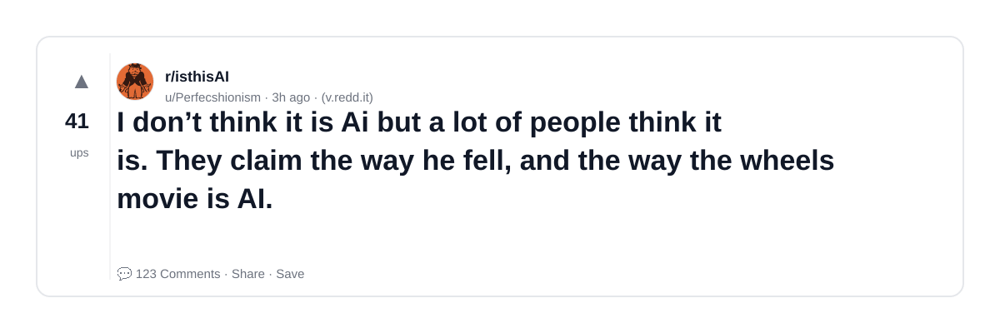

### 2) This Painting at a local art gallery selling for $1200. I’m convinced it’s ai.
- Subreddit: r/isthisAI
- Viral score: 233 | Ups: 6422 | Comments: 542 | Upvote ratio: 98%
- Link: https://www.reddit.com/r/isthisAI/comments/1rzlqkf/this_painting_at_a_local_art_gallery_selling_for/
- Card (local): ./cards/1rzlqkf.png

### 3) This looks like AI, which would be ironic. Any ideas? Found this on UpScrolled.
- Subreddit: r/isthisAI
- Viral score: 168 | Ups: 3097 | Comments: 54 | Upvote ratio: 98%
- Link: https://www.reddit.com/r/isthisAI/comments/1s10eh6/this_looks_like_ai_which_would_be_ironic_any/
- Card (local): ./cards/1s10eh6.png

### 4) Is this video of a little girl riding on a carriage being pulled by a Labrador AI?
- Subreddit: r/isthisAI
- Viral score: 166 | Ups: 753 | Comments: 109 | Upvote ratio: 89%
- Link: https://www.reddit.com/r/isthisAI/comments/1s1x4ru/is_this_video_of_a_little_girl_riding_on_a/
- Card (local): ./cards/1s1x4ru.png

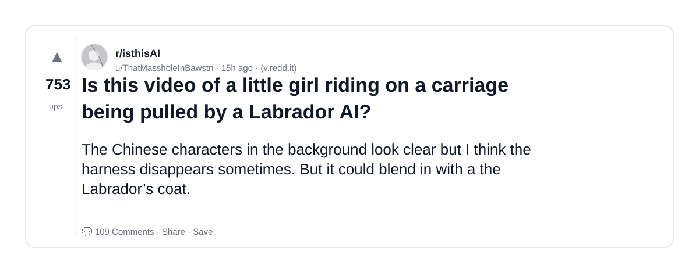

### 5) local restaurant posted this promo picture, but i suspect that they used AI to render this photo.
- Subreddit: r/isthisAI
- Viral score: 132 | Ups: 249 | Comments: 169 | Upvote ratio: 82%
- Link: https://www.reddit.com/r/isthisAI/comments/1s23ndq/local_restaurant_posted_this_promo_picture_but_i/
- Card (local): ./cards/1s23ndq.png

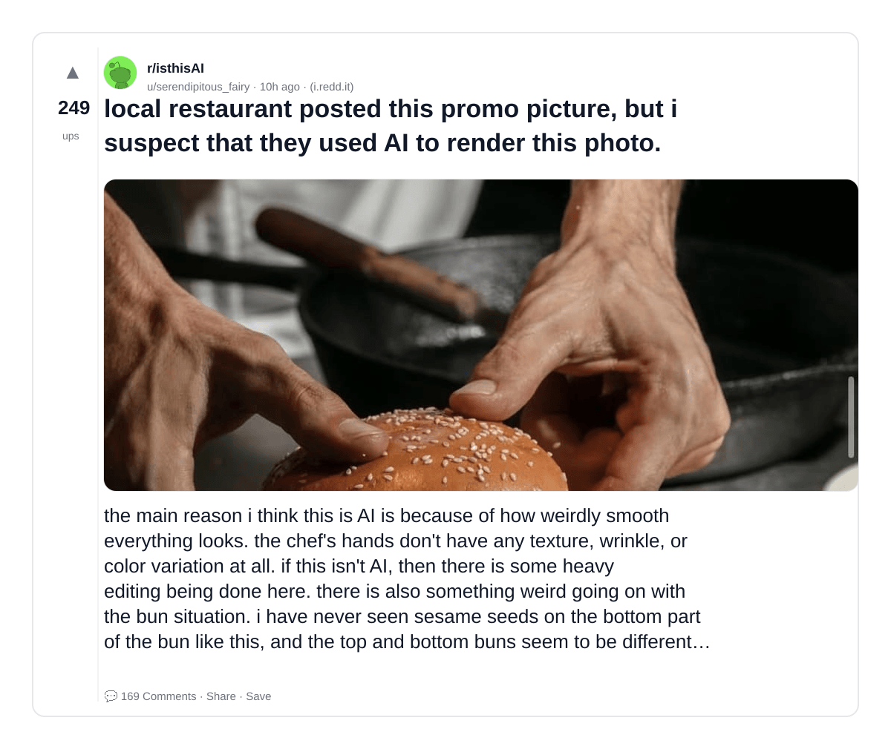

### 6) Is this sandwich AI or just very weirdly food styled? The steak makes so sense nor does the rocket
- Subreddit: r/isthisAI
- Viral score: 107 | Ups: 566 | Comments: 154 | Upvote ratio: 87%
- Link: https://www.reddit.com/r/isthisAI/comments/1s1pgws/is_this_sandwich_ai_or_just_very_weirdly_food/
- Card (local): ./cards/1s1pgws.png

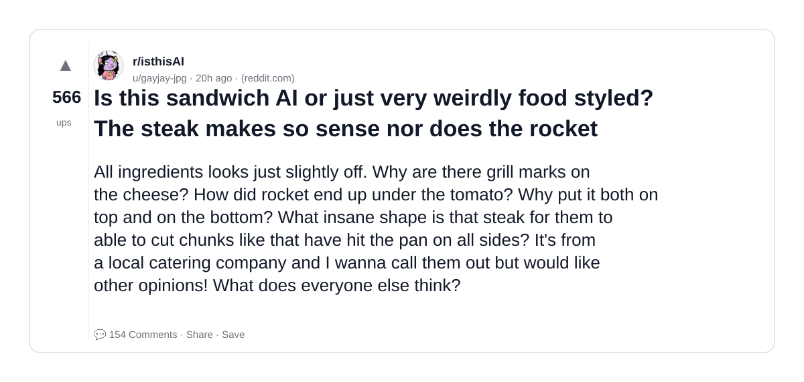

### 7) Help me Prove this is AI - my aunt thinks this is a real person she matched with online
- Subreddit: r/isthisAI
- Viral score: 97 | Ups: 12460 | Comments: 371 | Upvote ratio: 95%
- Link: https://www.reddit.com/r/isthisAI/comments/1rtsnxz/help_me_prove_this_is_ai_my_aunt_thinks_this_is_a/
- Card (local): ./cards/1rtsnxz.png

### 8) Is this video AI? The motion on the graphics looks like it was prompted rather than manually animated
- Subreddit: r/isthisAI
- Viral score: 93 | Ups: 1 | Comments: 1 | Upvote ratio: 100%
- Link: https://www.reddit.com/r/isthisAI/comments/1s2f2l1/is_this_video_ai_the_motion_on_the_graphics_looks/
- Card (local): ./cards/1s2f2l1.png

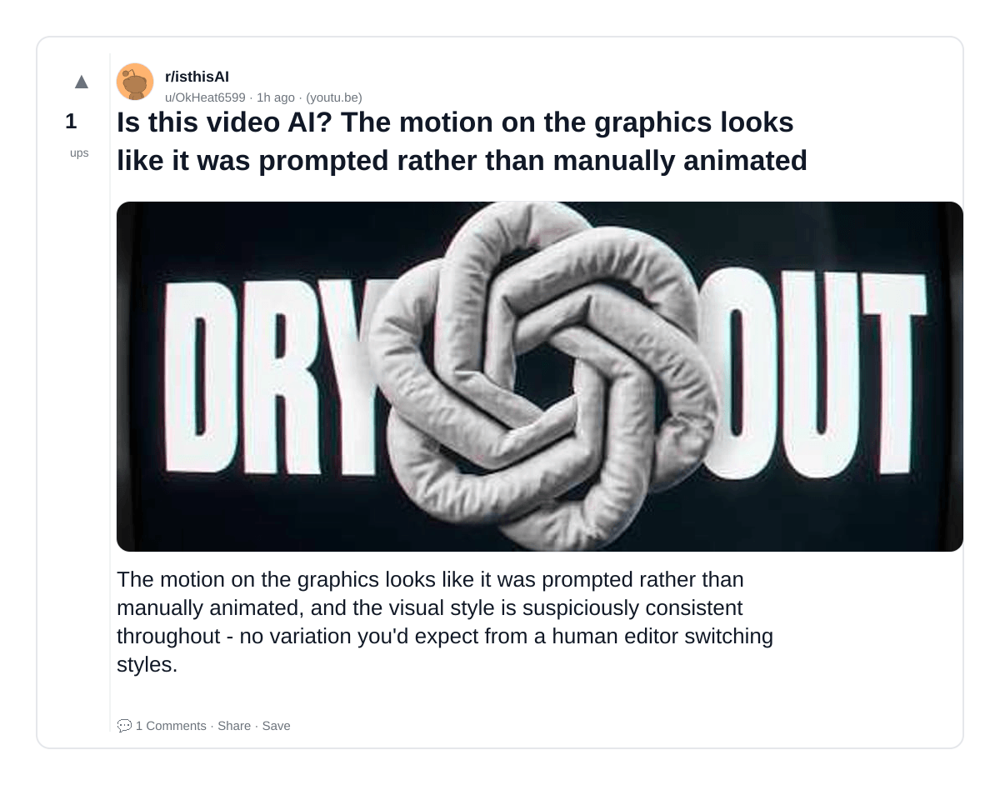

### 9) Is this Ai? I’m having a dollhouse made for my daughter’s birthday but the WIP provided does not look real. The glue bottles are unreadable/gibberish.
- Subreddit: r/isthisAI
- Viral score: 79 | Ups: 8951 | Comments: 1673 | Upvote ratio: 95%
- Link: https://www.reddit.com/r/isthisAI/comments/1rqnupu/is_this_ai_im_having_a_dollhouse_made_for_my/
- Card (local): ./cards/1rqnupu.png

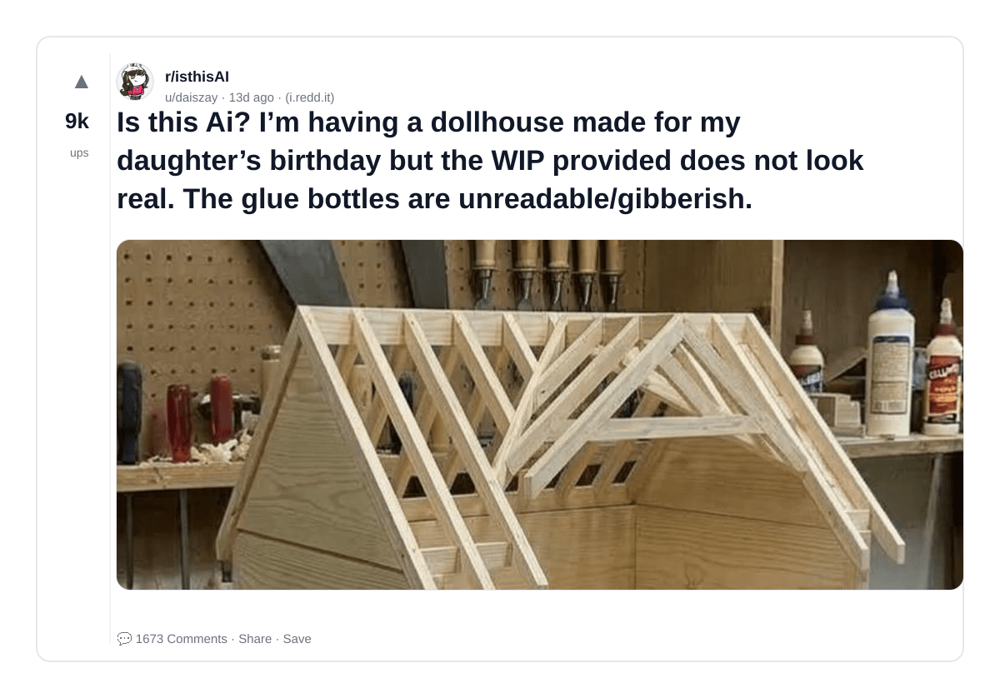

### 10) I'm normally quite confident about recognizing AI, but this one confuses me
- Subreddit: r/isthisAI
- Viral score: 78 | Ups: 407 | Comments: 90 | Upvote ratio: 88%
- Link: https://www.reddit.com/r/isthisAI/comments/1s1t1wk/im_normally_quite_confident_about_recognizing_ai/
- Card (local): ./cards/1s1t1wk.png

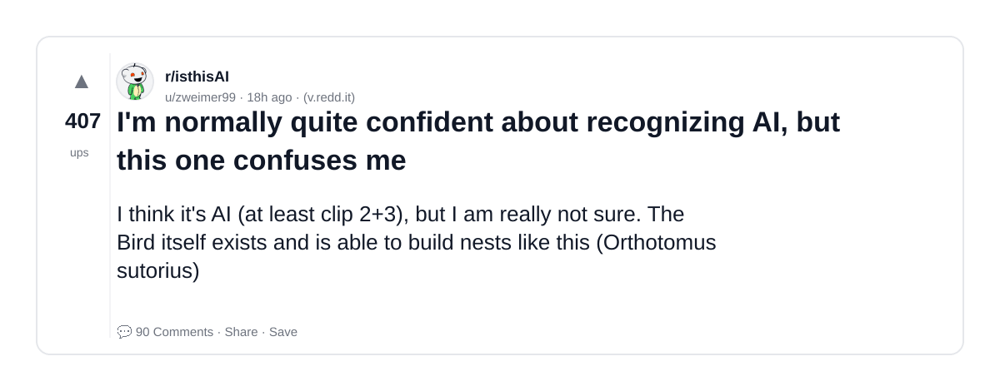

### 11) Stumbled upon this comic and it's making my brain itch. Comments didn't say anything about AI, but choices like giving all the deer those fawn spots, the whisker on the boar, the adult wolf's leg, and the vegetation are really suspect to me.
- Subreddit: r/isthisAI
- Viral score: 77 | Ups: 28 | Comments: 55 | Upvote ratio: 71%
- Link: https://www.reddit.com/r/isthisAI/comments/1s2agvy/stumbled_upon_this_comic_and_its_making_my_brain/
- Card (local): ./cards/1s2agvy.png

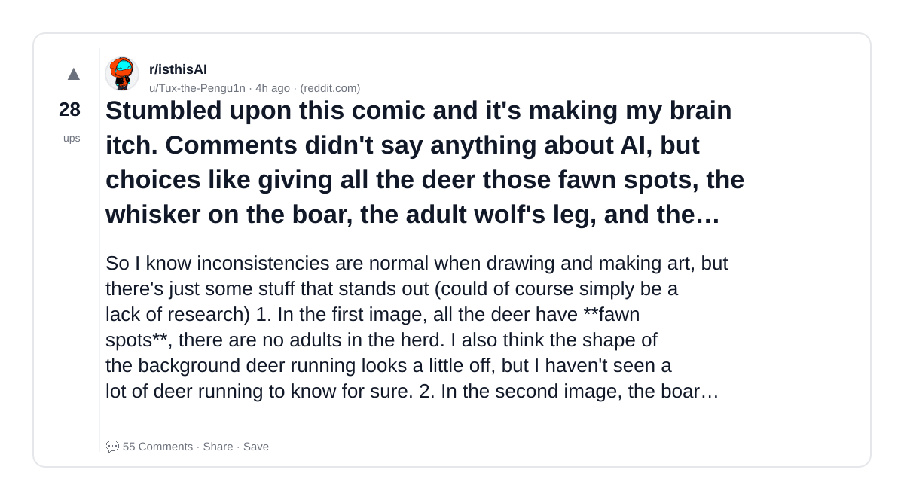

### 12) I’m convinced this is AI, but friends say it’s real. When I zoom in, I cant prove it’s AI. How do I prove it, or is it AI?
- Subreddit: r/isthisAI
- Viral score: 69 | Ups: 16887 | Comments: 806 | Upvote ratio: 83%
- Link: https://www.reddit.com/r/isthisAI/comments/1rmghxb/im_convinced_this_is_ai_but_friends_say_its_real/
- Card (local): ./cards/1rmghxb.png

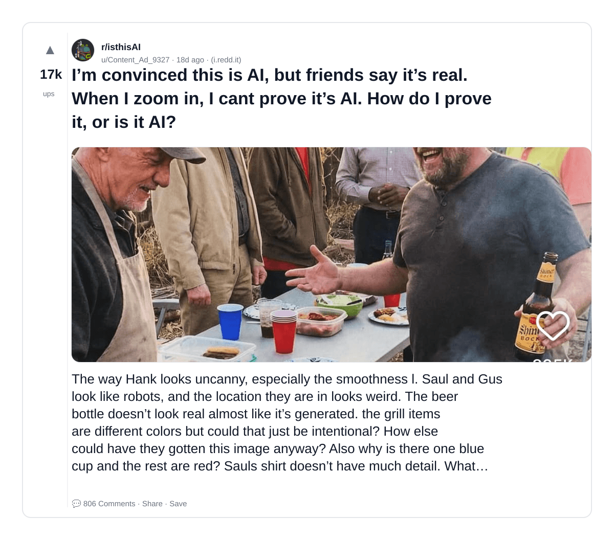

### 13) Vacation advertisement image reel could be AI? The clouds on the left are super bright and theres a weird artifact in the bottom right?
- Subreddit: r/isthisAI
- Viral score: 67 | Ups: 1 | Comments: 3 | Upvote ratio: 60%
- Link: https://www.reddit.com/r/isthisAI/comments/1s2ewak/vacation_advertisement_image_reel_could_be_ai_the/
- Card (local): ./cards/1s2ewak.png

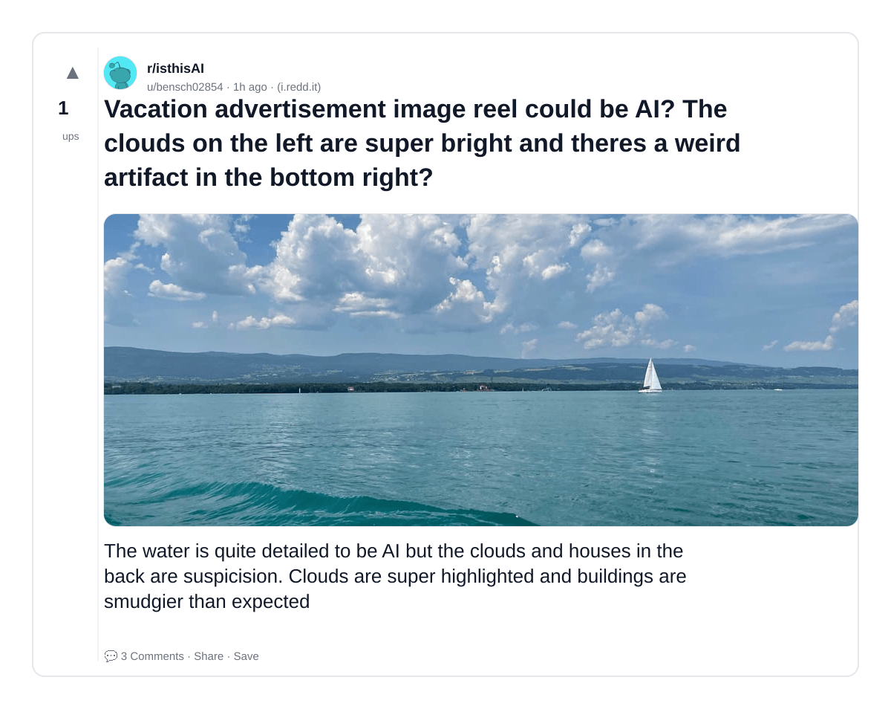

### 14) Is this AI? I saw this on twitter. There are a lot of identical cars and camels side by side.
- Subreddit: r/isthisAI
- Viral score: 67 | Ups: 4182 | Comments: 385 | Upvote ratio: 95%
- Link: https://www.reddit.com/r/isthisAI/comments/1rxivyv/is_this_ai_i_saw_this_on_twitter_there_are_a_lot/
- Card (local): ./cards/1rxivyv.png

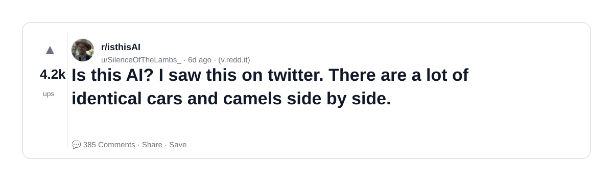

### 15) Dog chooses owner event, found this video on tiktok, most comments think it's AI
- Subreddit: r/isthisAI
- Viral score: 52 | Ups: 12876 | Comments: 730 | Upvote ratio: 92%
- Link: https://www.reddit.com/r/isthisAI/comments/1rljhcq/dog_chooses_owner_event_found_this_video_on/
- Card (local): ./cards/1rljhcq.png

### 16) Need a medical person to say why this is AI. Someone is being scammed by an impersonator. They are saying he needs money for a heart transplant.
- Subreddit: r/isthisAI
- Viral score: 51 | Ups: 7938 | Comments: 2039 | Upvote ratio: 94%
- Link: https://www.reddit.com/r/isthisAI/comments/1rlqm7j/need_a_medical_person_to_say_why_this_is_ai/
- Card (local): ./cards/1rlqm7j.png

### 17) Found some of his songs on Spotify and it sound like a totally diferrent person. Is this AI?
- Subreddit: r/isthisAI
- Viral score: 50 | Ups: 220 | Comments: 170 | Upvote ratio: 74%
- Link: https://www.reddit.com/r/isthisAI/comments/1s1mcyv/found_some_of_his_songs_on_spotify_and_it_sound/
- Card (local): ./cards/1s1mcyv.png

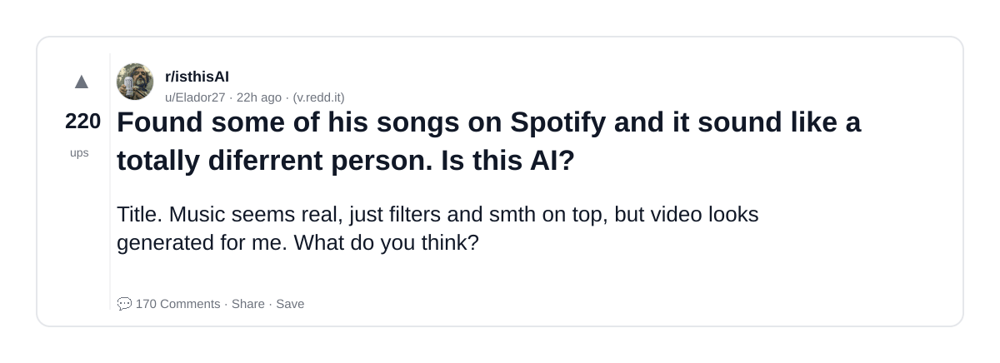

### 18) Agents before AI was a thing
- Subreddit: r/OpenAI
- Viral score: 46 | Ups: 1563 | Comments: 63 | Upvote ratio: 94%
- Link: https://www.reddit.com/r/OpenAI/comments/1rzxcw5/agents_before_ai_was_a_thing/
- Card (local): ./cards/1rzxcw5.png

### 19) I am 99% sure this person stole OP's art style and fed it into AI. I want to know what everyone else thinks.
- Subreddit: r/isthisAI
- Viral score: 44 | Ups: 133 | Comments: 42 | Upvote ratio: 91%
- Link: https://www.reddit.com/r/isthisAI/comments/1s22zw2/i_am_99_sure_this_person_stole_ops_art_style_and/
- Card (local): ./cards/1s22zw2.png

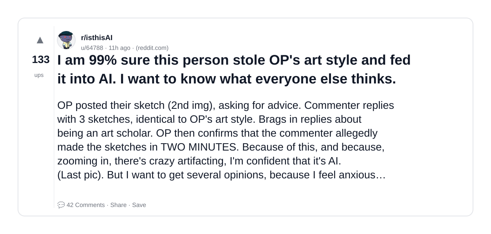

### 20) Wrong Universe LOTR vs Pawn Stars AI Mashup
- Subreddit: r/aivideo
- Viral score: 43 | Ups: 7474 | Comments: 197 | Upvote ratio: 90%
- Link: https://www.reddit.com/r/aivideo/comments/1rqgolw/wrong_universe_lotr_vs_pawn_stars_ai_mashup/
- Card (local): ./cards/1rqgolw.png

### 21) AI Is Quietly Becoming Infrastructure, Not a Product
- Subreddit: r/OpenAI
- Viral score: 42 | Ups: 32 | Comments: 28 | Upvote ratio: 80%
- Link: https://www.reddit.com/r/OpenAI/comments/1s29stz/ai_is_quietly_becoming_infrastructure_not_a/
- Card (local): ./cards/1s29stz.png

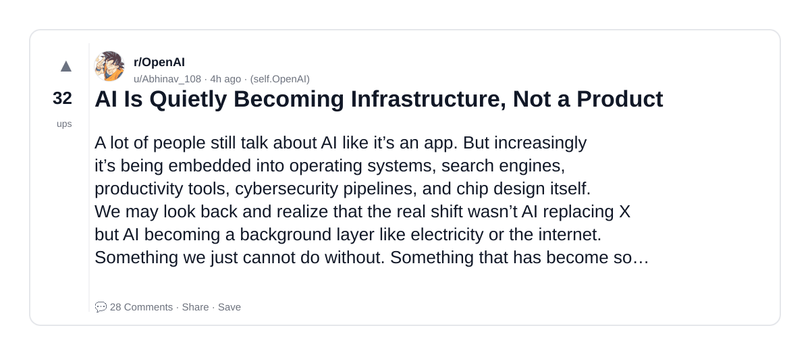

### 22) The text looks off, and I can't tell if people are getting too lazy to put text on images without using AI?
- Subreddit: r/isthisAI
- Viral score: 42 | Ups: 1944 | Comments: 82 | Upvote ratio: 95%
- Link: https://www.reddit.com/r/isthisAI/comments/1rzhad2/the_text_looks_off_and_i_cant_tell_if_people_are/
- Card (local): ./cards/1rzhad2.png

### 23) Neil DeGrasse Tyson calls for an international treaty to ban superintelligence: "That branch of AI is lethal. We've got do something about that. Nobody should build it. And everyone needs to agree to that by treaty. Treaties are not perfect, but they are the best we have as humans."
- Subreddit: r/OpenAI
- Viral score: 41 | Ups: 449 | Comments: 311 | Upvote ratio: 81%
- Link: https://www.reddit.com/r/OpenAI/comments/1s0sjty/neil_degrasse_tyson_calls_for_an_international/
- Card (local): ./cards/1s0sjty.png

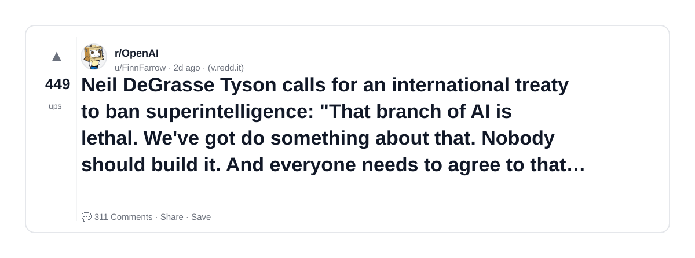

### 24) Is this picture that my uncle swears he took at Walmart, ai or real? I cannot figure it out
- Subreddit: r/isthisAI
- Viral score: 40 | Ups: 8283 | Comments: 2310 | Upvote ratio: 92%
- Link: https://www.reddit.com/r/isthisAI/comments/1rgtpru/is_this_picture_that_my_uncle_swears_he_took_at/
- Card (local): ./cards/1rgtpru.png

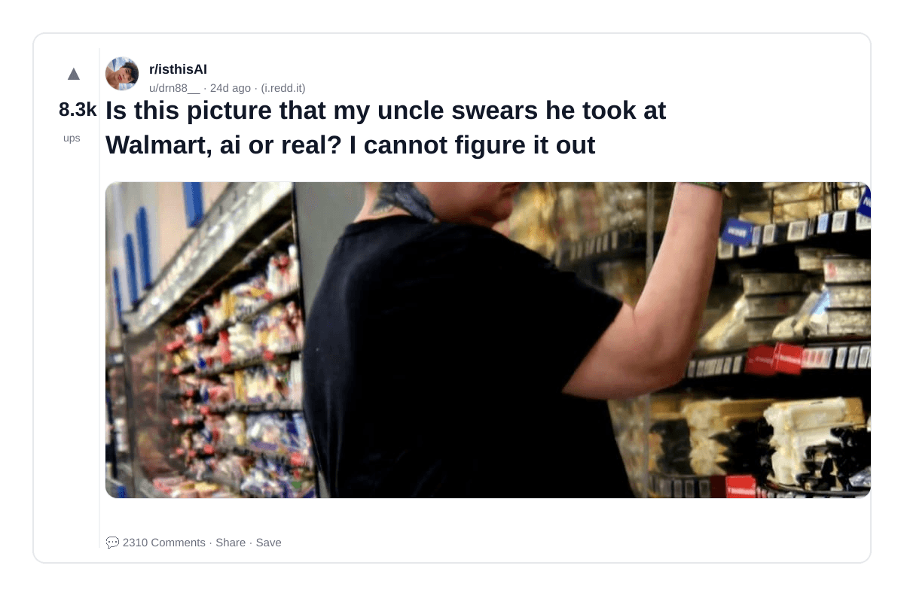

### 25) I don’t think this video is AI, but everyone in the comments says it is… Am I wrong??
- Subreddit: r/isthisAI
- Viral score: 40 | Ups: 650 | Comments: 107 | Upvote ratio: 95%
- Link: https://www.reddit.com/r/isthisAI/comments/1s135eu/i_dont_think_this_video_is_ai_but_everyone_in_the/
- Card (local): ./cards/1s135eu.png

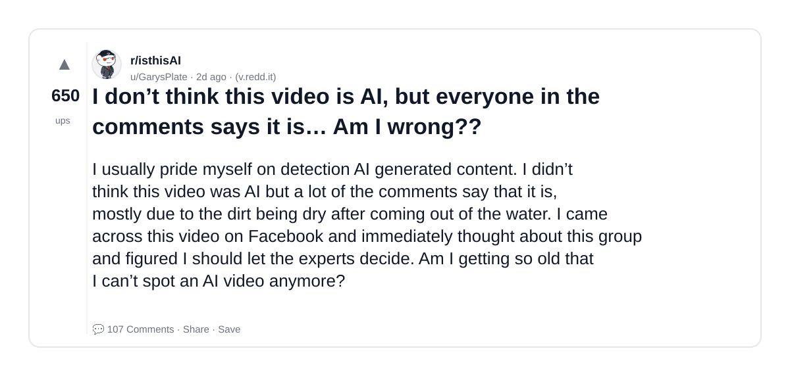

### 26) Is this fan art ai? The artist and others are jumping down people's throats over it, but something seems off to me.
- Subreddit: r/isthisAI
- Viral score: 36 | Ups: 1797 | Comments: 338 | Upvote ratio: 87%
- Link: https://www.reddit.com/r/isthisAI/comments/1rygbyu/is_this_fan_art_ai_the_artist_and_others_are/
- Card (local): ./cards/1rygbyu.png

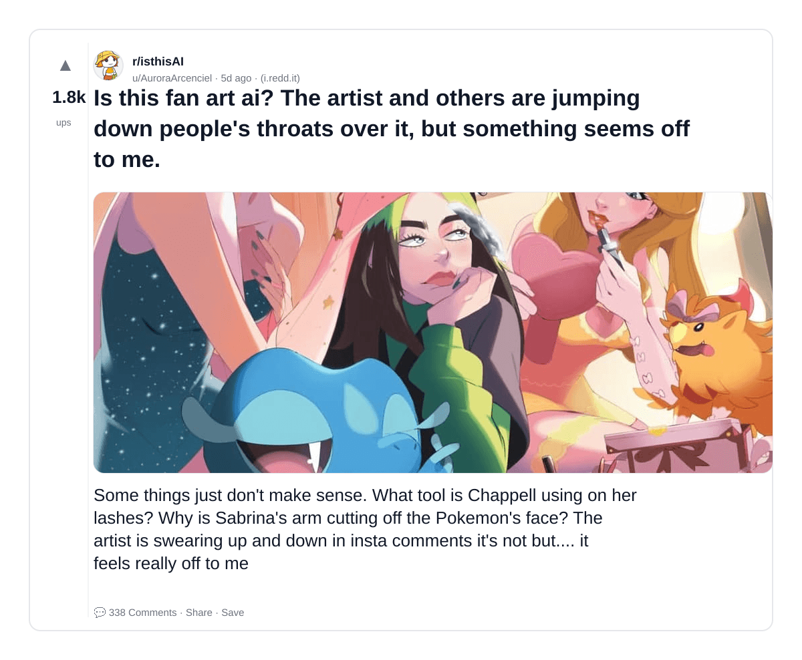

### 27) Sorry guys is this AI? I love lizards but this tail looks suspiciously long. I checked with Gemini but it’s not giving me a proper answer. Thanks in advance
- Subreddit: r/isthisAI
- Viral score: 36 | Ups: 1 | Comments: 13 | Upvote ratio: 67%
- Link: https://www.reddit.com/r/isthisAI/comments/1s2d9ti/sorry_guys_is_this_ai_i_love_lizards_but_this/
- Card (local): ./cards/1s2d9ti.png

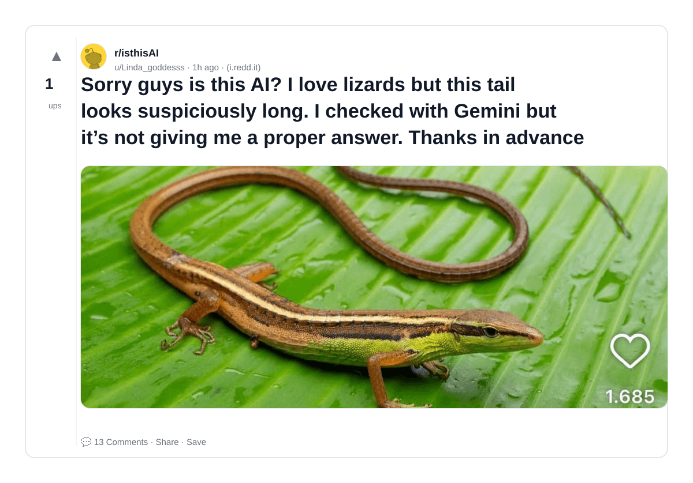

### 28) This photo was labeled as AI in another sub. It’s not..can this sub prove it’s real?
- Subreddit: r/isthisAI
- Viral score: 32 | Ups: 7727 | Comments: 997 | Upvote ratio: 94%
- Link: https://www.reddit.com/r/isthisAI/comments/1rhb54i/this_photo_was_labeled_as_ai_in_another_sub_its/
- Card (local): ./cards/1rhb54i.png

### 29) My gut is telling me that this is definitely AI. But I can't find anything too suspicious about it.
- Subreddit: r/isthisAI
- Viral score: 30 | Ups: 1460 | Comments: 146 | Upvote ratio: 86%
- Link: https://www.reddit.com/r/isthisAI/comments/1rymx6d/my_gut_is_telling_me_that_this_is_definitely_ai/
- Card (local): ./cards/1rymx6d.png

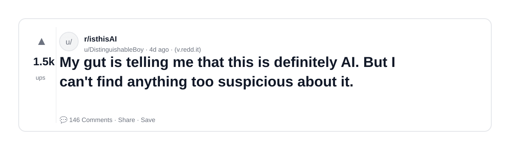

### 30) "Keep Cooking", an AI Short Film by Simon Meyer
- Subreddit: r/aivideo
- Viral score: 28 | Ups: 1397 | Comments: 328 | Upvote ratio: 85%
- Link: https://www.reddit.com/r/aivideo/comments/1rxqj00/keep_cooking_an_ai_short_film_by_simon_meyer/
- Card (local): ./cards/1rxqj00.png

