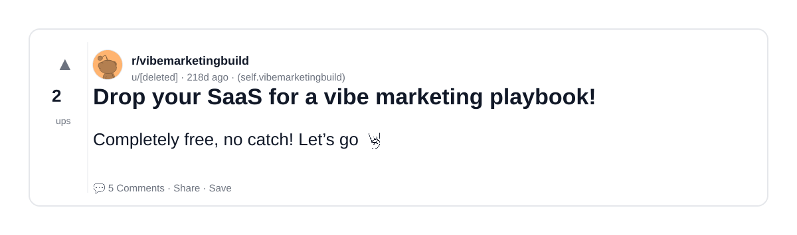
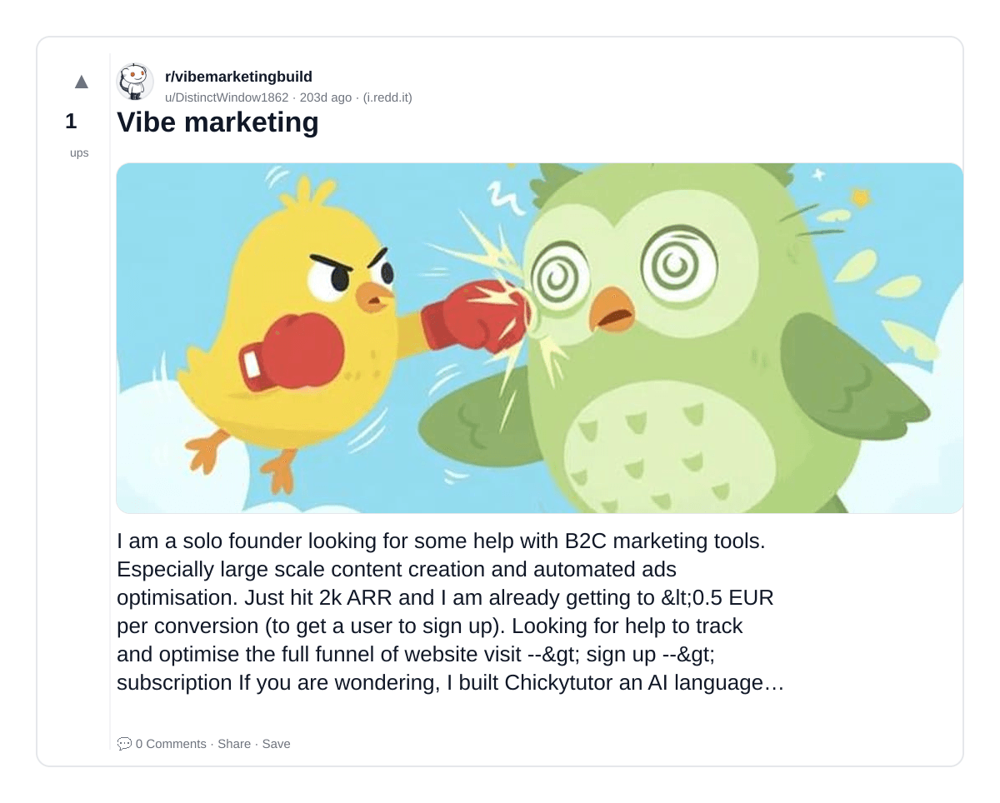

# Reddit Scout — Vibe Outreach

Run: 2026-03-24T15-27-12-664Z
Started: 2026-03-24T15:27:12.664Z
Output dir: /home/ubuntu/.openclaw/workspace-ce/users/8176450202/reddit-scout/vibe-outreach/runs/2026-03-24T15-27-12-664Z

Config: topN=20 | subLimit=12 | kinds=top,hot,rising | time=week | limitPerListing=25
Search: Vibe Outreach (sort=top t=auto)

## Top terms (from titles + top comments)

- vibe (3)
- marketing (3)
- comment (2)
- launch (2)
- have (2)
- drop (1)
- saas (1)
- playbook (1)
- sections (1)
- super (1)
- https (1)
- superlaun (1)
- clean (1)
- minimal (1)
- product (1)
- platform (1)
- currently (1)
- visitors (1)

## Viral content ideas (derived from these posts)

**1. Personal story → timeline + receipts**
- Hook: Hook with 1 line, then a 5-step timeline; end with the lesson and what you would do differently.

**2. My vibe got automated: what I automated back (tools + workflow)**
- Hook: Turn it into a before/after workflow post. Include exact tool stack + steps.

**3. Checklist: how to stay valuable when marketing hits your team**
- Hook: A numbered checklist (10 items). Make it practical: skills, portfolio, outreach, proof-of-work.

**4. Hot take: comment isn't the problem — launch is**
- Hook: Contrarian framing. Back it with 2 examples from the top posts and 1 counterexample.

**5. Debunk thread: "AI will replace have" vs what's actually happening**
- Hook: Use 3 claims → 3 rebuttals. Cite specific post patterns: layoffs, hiring freezes, role shifts.

**6. Salary/market reality: drop vs saas roles in 2026 (Reddit signals)**
- Hook: Summarize demand signals from comments: who is struggling, who is fine, why.

**7. "What would you do in 30 days?" layoff recovery plan (day-by-day)**
- Hook: 30-day plan: portfolio, interview loops, networking, mental health. Include a downloadable checklist.

**8. Mini-case study: 1 resume bullet → 1 proof project using playbook**
- Hook: Show how to convert a vague resume claim into a measurable project + writeup.

**9. Community question: which tasks should *never* be delegated to AI?**
- Hook: Ask + give your own top 5. Encourage replies; add a poll if your platform supports it.

**10. Template post: "I used AI to do X, got Y result, here's the exact prompt"**
- Hook: Make it reproducible: prompt, inputs, outputs, gotchas.

**11. Data post: a quick scorecard of the top threads (ups, comments, ratio) + what it signals**
- Hook: Table or bullets; then 3 takeaways.

**12. Meme angle (if relevant): sections vs super — job search edition**
- Hook: If your niche is not memes, skip memes; otherwise caption the pattern you saw in comments.

## Top posts (3) + cards

### 1) Drop your SaaS for a vibe marketing playbook!
- Subreddit: r/vibemarketingbuild
- Viral score: 0 | Ups: 2 | Comments: 5 | Upvote ratio: 100%
- Link: https://www.reddit.com/r/vibemarketingbuild/comments/1mu1p8c/drop_your_saas_for_a_vibe_marketing_playbook/
- Card (local): ./cards/1mu1p8c.png

### 2) Vibe marketing in comment sections
- Subreddit: r/vibemarketingbuild
- Viral score: 0 | Ups: 2 | Comments: 2 | Upvote ratio: 100%
- Link: https://www.reddit.com/r/vibemarketingbuild/comments/1mv4txs/vibe_marketing_in_comment_sections/
- Card (local): ./cards/1mv4txs.png

### 3) Vibe marketing
- Subreddit: r/vibemarketingbuild
- Viral score: 0 | Ups: 1 | Comments: 0 | Upvote ratio: 100%
- Link: https://www.reddit.com/r/vibemarketingbuild/comments/1n6w606/vibe_marketing/
- Card (local): ./cards/1n6w606.png

