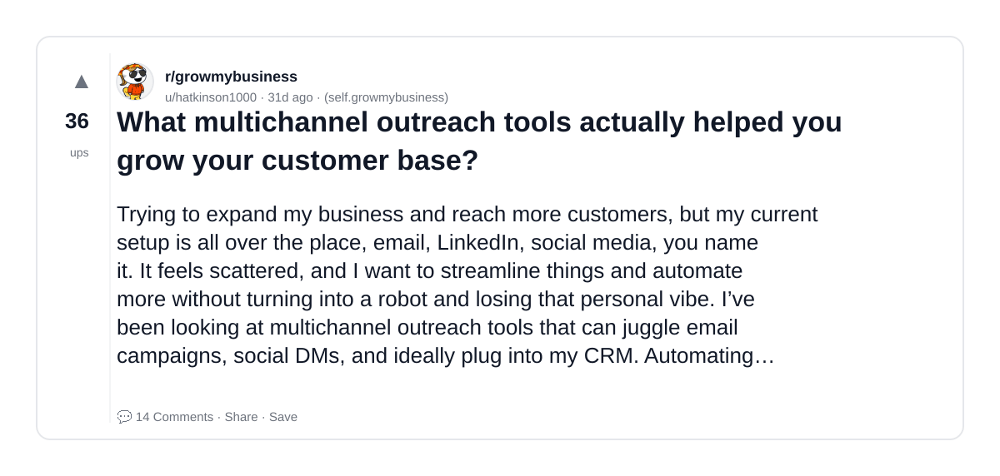
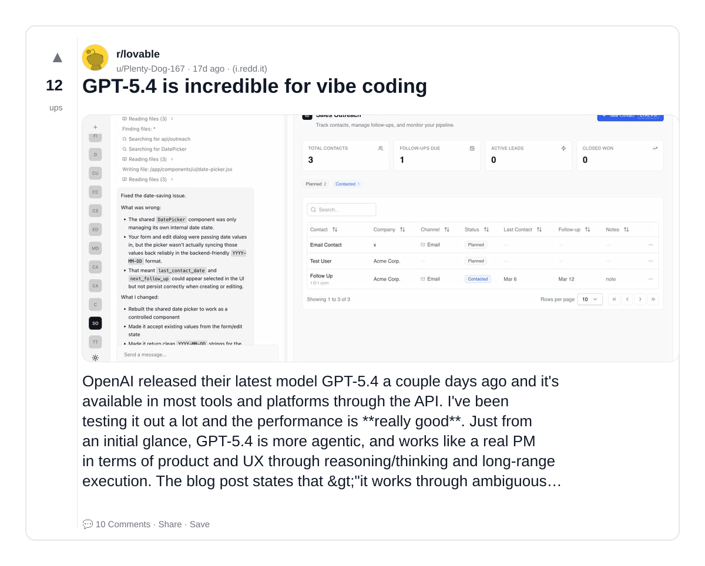
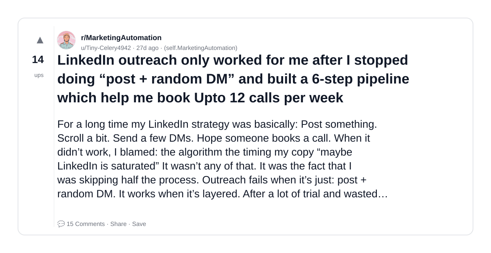
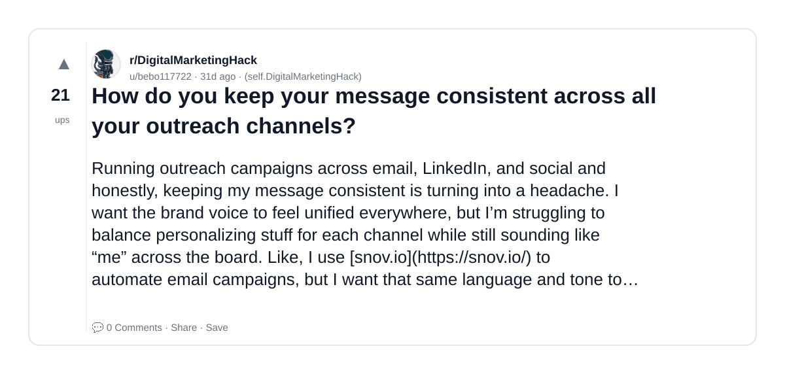
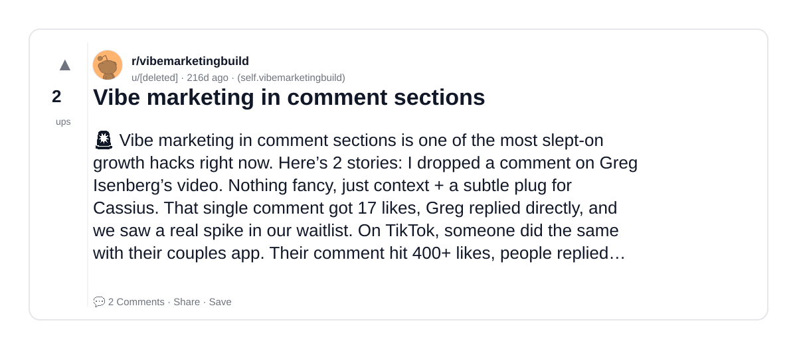

# Reddit Scout — Vibe Outreach

Run: 2026-03-24T15-27-28-285Z
Started: 2026-03-24T15:27:28.286Z
Output dir: /home/ubuntu/.openclaw/workspace-ce/users/8176450202/reddit-scout/vibe-outreach/runs/2026-03-24T15-27-28-285Z

Config: topN=30 | subLimit=15 | kinds=top,hot,rising | time=month | limitPerListing=25
Search: Vibe Outreach (sort=top t=auto)

## Top terms (from titles + top comments)

- linkedin (8)
- what (6)
- tools (6)
- actually (6)
- vibe (6)
- outreach (5)
- email (5)
- which (4)
- instead (4)
- random (3)
- consistent (3)
- across (3)
- channels (3)
- marketing (3)
- follow (3)
- first (3)
- most (3)
- people (3)

## Viral content ideas (derived from these posts)

**1. Personal story → timeline + receipts**
- Hook: Hook with 1 line, then a 5-step timeline; end with the lesson and what you would do differently.

**2. My linkedin got automated: what I automated back (tools + workflow)**
- Hook: Turn it into a before/after workflow post. Include exact tool stack + steps.

**3. Checklist: how to stay valuable when what hits your team**
- Hook: A numbered checklist (10 items). Make it practical: skills, portfolio, outreach, proof-of-work.

**4. Hot take: tools isn't the problem — actually is**
- Hook: Contrarian framing. Back it with 2 examples from the top posts and 1 counterexample.

**5. Debunk thread: "AI will replace vibe" vs what's actually happening**
- Hook: Use 3 claims → 3 rebuttals. Cite specific post patterns: layoffs, hiring freezes, role shifts.

**6. Salary/market reality: outreach vs email roles in 2026 (Reddit signals)**
- Hook: Summarize demand signals from comments: who is struggling, who is fine, why.

**7. "What would you do in 30 days?" layoff recovery plan (day-by-day)**
- Hook: 30-day plan: portfolio, interview loops, networking, mental health. Include a downloadable checklist.

**8. Mini-case study: 1 resume bullet → 1 proof project using which**
- Hook: Show how to convert a vague resume claim into a measurable project + writeup.

**9. Community question: which tasks should *never* be delegated to AI?**
- Hook: Ask + give your own top 5. Encourage replies; add a poll if your platform supports it.

**10. Template post: "I used AI to do X, got Y result, here's the exact prompt"**
- Hook: Make it reproducible: prompt, inputs, outputs, gotchas.

**11. Data post: a quick scorecard of the top threads (ups, comments, ratio) + what it signals**
- Hook: Table or bullets; then 3 takeaways.

**12. Meme angle (if relevant): instead vs random — job search edition**
- Hook: If your niche is not memes, skip memes; otherwise caption the pattern you saw in comments.

## Top posts (7) + cards

### 1) What multichannel outreach tools actually helped you grow your customer base?
- Subreddit: r/growmybusiness
- Viral score: 0 | Ups: 36 | Comments: 14 | Upvote ratio: 100%
- Link: https://www.reddit.com/r/growmybusiness/comments/1razqez/what_multichannel_outreach_tools_actually_helped/
- Card (local): ./cards/1razqez.png

### 2) GPT-5.4 is incredible for vibe coding
- Subreddit: r/lovable
- Viral score: 0 | Ups: 12 | Comments: 10 | Upvote ratio: 83%
- Link: https://www.reddit.com/r/lovable/comments/1rnmge8/gpt54_is_incredible_for_vibe_coding/
- Card (local): ./cards/1rnmge8.png

### 3) LinkedIn outreach only worked for me after I stopped doing “post + random DM” and built a 6-step pipeline which help me book Upto 12 calls per week
- Subreddit: r/MarketingAutomation
- Viral score: 0 | Ups: 14 | Comments: 15 | Upvote ratio: 94%
- Link: https://www.reddit.com/r/MarketingAutomation/comments/1regkxy/linkedin_outreach_only_worked_for_me_after_i/
- Card (local): ./cards/1regkxy.png

### 4) How do you keep your message consistent across all your outreach channels?
- Subreddit: r/DigitalMarketingHack
- Viral score: 0 | Ups: 21 | Comments: 0 | Upvote ratio: 100%
- Link: https://www.reddit.com/r/DigitalMarketingHack/comments/1razzuo/how_do_you_keep_your_message_consistent_across/
- Card (local): ./cards/1razzuo.png

### 5) Drop your SaaS for a vibe marketing playbook!
- Subreddit: r/vibemarketingbuild
- Viral score: 0 | Ups: 2 | Comments: 5 | Upvote ratio: 100%
- Link: https://www.reddit.com/r/vibemarketingbuild/comments/1mu1p8c/drop_your_saas_for_a_vibe_marketing_playbook/
- Card (local): ./cards/1mu1p8c.png

### 6) Vibe marketing in comment sections
- Subreddit: r/vibemarketingbuild
- Viral score: 0 | Ups: 2 | Comments: 2 | Upvote ratio: 100%
- Link: https://www.reddit.com/r/vibemarketingbuild/comments/1mv4txs/vibe_marketing_in_comment_sections/
- Card (local): ./cards/1mv4txs.png

### 7) Vibe marketing
- Subreddit: r/vibemarketingbuild
- Viral score: 0 | Ups: 1 | Comments: 0 | Upvote ratio: 100%
- Link: https://www.reddit.com/r/vibemarketingbuild/comments/1n6w606/vibe_marketing/
- Card (local): ./cards/1n6w606.png

